# Fancy Calculator

Задача начального уровня для практики навыка отладки юнит тестов в Visual Studio. Переводы: [Английский](README.md).


## SonarLint

Рекомендуем установить [расширение SonarLint для Visual Studio](https://www.sonarlint.org/visualstudio). Это расширение очень полезно во время разработки, потому что оно обнаруживает "на лету" проблемы качества и безопасности кода и выделяет их в редакторе кода Visual Studio.

1. Откройте окно "Extensions", нажав элемент меню _Extensions\Manage Extensions_.

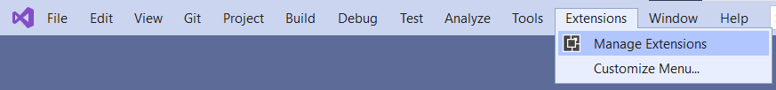

2. Найдите расширение "SonarLint" в поисковой строке и скачайте расширение.

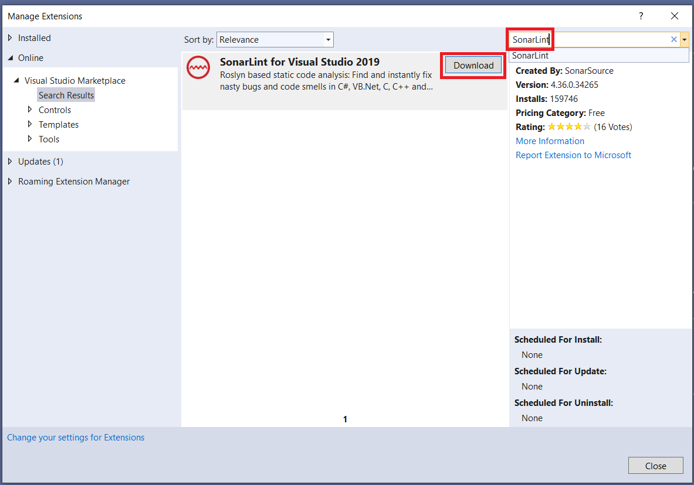

3. Visual Studio следует перезапустить. Закройте приложение.

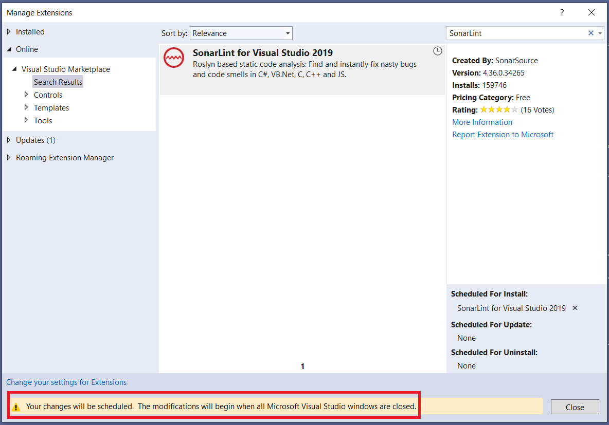

4. Появится окно установщика расширений. Нажмите на кнопку "Modify".

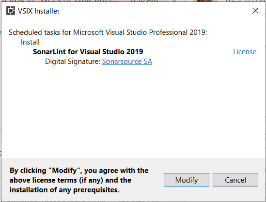

5. Когда расширение "SonarLint" установится снова запустите приложение. Сейчас Visual Studio будет указывать на проблемы, обнаруженные Sonar в окне редактора кода, подчеркивая проблемные места волнистой линией.


## Завершите задачу

1. [Соберите проект](https://docs.microsoft.com/en-us/visualstudio/ide/building-and-cleaning-projects-and-solutions-in-visual-studio).
    * Выберите элемент меню - _Build\Build Solution_.
    * Или используйте сочетание клавиш - _Ctrl+Shift+B_.

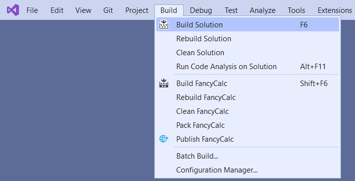

2. Откройте [Test Explorer](https://docs.microsoft.com/ru-ru/visualstudio/test/run-unit-tests-with-test-explorer).
    * Выберите элемент меню - _View\Test Explorer_.
    * Или используйте сочетание клавиш - _Ctrl+E, T_.


3. Запустите все юнит-тесты. Проект содержит 20 юнит тестов, как минимум 15 юнит тестов в Test Explorer должны быть "красными".
    * Выберите элемент меню - _Test\Run All Tests_.
    * Или используйте сочетание клавиш - _Ctrl+R, A_.


4. Двойной клик на юнит-тесте "Plus_WithOneAndOne_ReturnsTwo". Visual Studio откроет окно редактора кода для [OperationsTests.cs](FancyCalc.Tests/OperationsTests.cs) файла и перенаправит вас к коду юнит-теста.

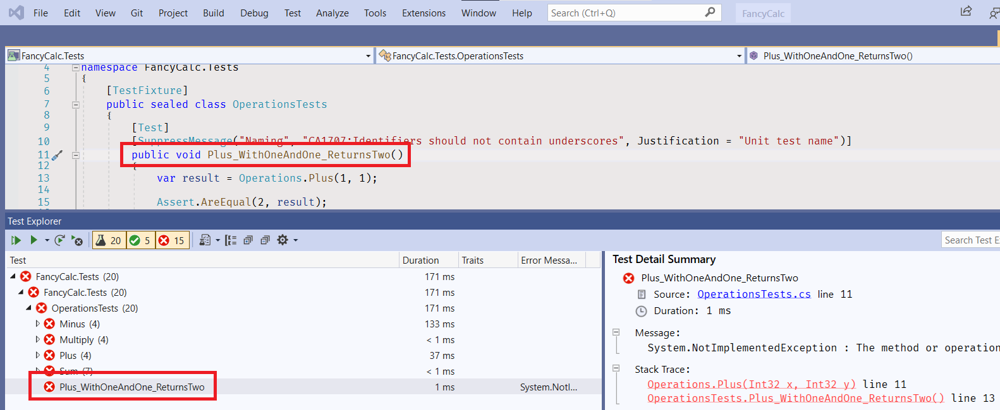

5. Перейдите к коду "Operations.Plus" метода.
    * Нажмите правой кнопкой мыши на имя метода "Plus" на 13 строке и нажмите на элементе меню "Go to Definition".
    * Или кликните на имени метода "Plus" на 13 строке и используйте сочетание клавиш _F12_.
    * Или кликните на имени метода "Plus" на 13 строке, зажав клавишу _Ctrl_.


6. Visual Studio откроет окно редактора кода для [Operations.cs](FancyCalc/Operations.cs) файла и перенаправит вас к коду метода.
1. Перейдите на строку 10.
    * Используйте клавиши курсора.
    * Или используйте сочетание клавиш - _Ctrl+G_, нажмите 10 и клавишу _Enter_.

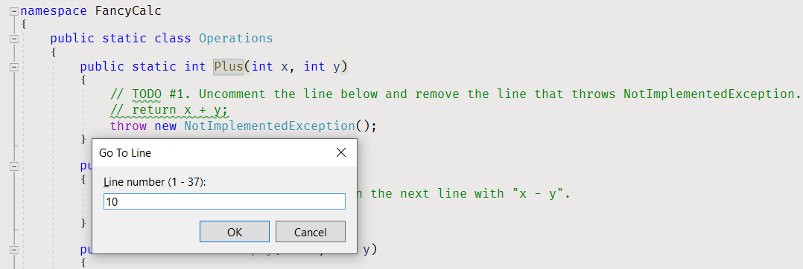

8. Раскомментируйте текущую строку.
    * Используйте сочетание клавиш - _Ctrl+K, Ctrl+U_.

```cs
public static int Plus(int x, int y)
{
    // TODO #1. Раскомментируйте строку ниже и удалите строку, которая выбрасывает throws NotImplementedException.
    return x + y;
    throw new NotImplementedException();
}
```

9. Перейдите на следующую строку - строка 11.
10. Закомментируйте текущую строку.
    * Используйте сочетание клавиш - _Ctrl+K, Ctrl+C_.

```cs
public static int Plus(int x, int y)
{
    // TODO #1. Раскоментируйте линию ниже и удалите строку, которая выбрасывает NotImplementedException.
    return x + y;
    //throw new NotImplementedException();
}
```

11. Откройте вкладку Test Explorer, запустите все юнит-тесты. Все "Plus" юнит-тесты и "Plus_WithOneAndOne_ReturnsTwo" юнит-тесты сейчас "зеленые".


12. Просмотрите "Minus" юнит-тесты в списке тестов. Только один юнит-тест "зеленый", другие - "красные".


13. Перейдите к коду юнит-теста, а затем перейдите к коду метода "Minus" в файле [Operations.cs](FancyCalc/Operations.cs).

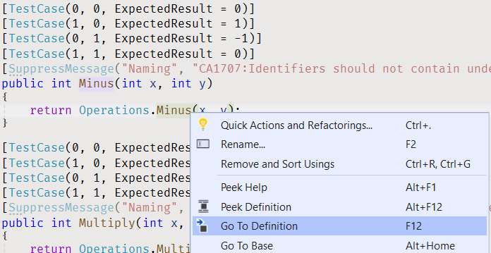

14. Исправьте код метода "Minus" в соответствии с TODO комментариями.

```cs
public static int Minus(int x, int y)
{
    // TODO #2. Замените "x + y - x" на следующей строке следующим "x - y".
    return x - y;
}
```

15. Откройте вкладку Test Explorer, кликните на строке "Minus (4)" и запустите все юнит-тесты "Minus", используя пункт меню при клике правой кнопки мыши. Юнит тесты "Minus" должны быть зелеными.


16. Перейдите к юнит-тесту "Multiply", а затем к коду метода "Multiply" в файле [Operations.cs](FancyCalc/Operations.cs).


17. Добавьте точку останова на строке 23.
    * Кликните на вертикальной полосе слева от строки 23.
    * Или используйте клавишу - _F9_.


18. Откройте вкладку Test Explorer и запустите "зеленый" юнит-тест "Multiply(0, 0)" в режиме отладки.
    * Кликните правой кнопкой мыши на юнит-тесте "Multiply" и выберите элемент меню "Debug".
    * Или используйте сочетание клавиш - _Ctrl+R, T_.


19. Отследите выполнение программы.
    * Кликните на элементе меню "Debug\Step Over".
    * Или используйте клавишу - _F10_.
    * Или используйте соответствующий пункт меню вкладки "Debug" на панели меню.


20. Изучите переменную "result".
    * Наведите курсор мыши на переменную "result" на строке 24.


21. Остановите отладку.
    * Кликните на элементе меню "Debug\Stop Debugging".
    * Или используйте клавишу - _Shift+F5_.


22. Удалите точку останова на строке 23 и добавьте точку останова на строке 24.


23. Выполните "красный" юнит-тест "Multiply(0, 1)" снова в режиме отладки.

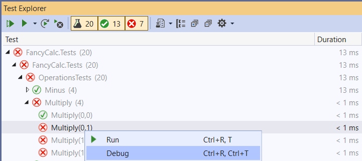

24. Изучите переменную "result".


25. Продолжите выполнение программы.
    * Кликните на пункте меню "Debug\Continue".
    * Или используйте клавишу - _F5_.
    * Или используйте соответствующий пункт меню вкладки "Debug" на панели меню.


26. Исправьте код метода "Multiply".

```cs
public static int Multiply(int x, int y)
{
    // TODO #3. Добавьте точку останова на следующую строку, запустите юнит-тест в режиме отладки и изучите переменную result во время выполнения.
    int result = x * y;
    return result;
}
```

27. Откройте вкладку Test Explorer и запустите снова все юнит-тесты "Multiply". Сейчас юнит-тесты "Multiply" должны быть "зелеными".


28. Откройте вкладку Test Explorer и запустите все юнит-тесты "Sum". Некоторые юнит-тесты должны быть "красными".

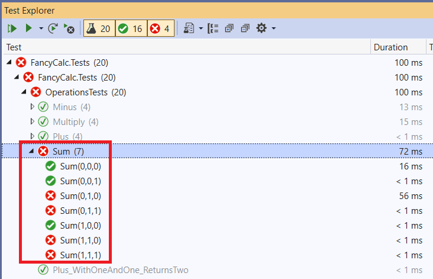

29. Добавьте точку останова на строке 30.


30. Запустите один из проваленных юнит-тестов в режиме отладки.


31. Проследите выполнение программы, чтобы обнаружить проблему.
32. Исправьте код.

```cs
public static int Sum(int x1, int x2, int x3)
{
    // TODO #4. Добавьте точку останова на следующую строку, запустите юнит-тест в режиме отладки и изучите выполнение программы.
    int sum1 = x1 + x2;
    int sum = sum1 + x3;
    return sum;
}
```

33. Откройте вкладку Test Explorer и запустите все юнит-тесты "Sum". Сейчас юнит-тесты "Sum" должны быть "зелеными".


34. Запустите все юнит-тесты и удостоверьтесь, что все они "зеленые".


35. Перекомпилируйте решение.
    * Нажмите на пункт меню - _Build\Rebuild Solution_.


36. Откройте панель "Error List". Панель содержит два предупреждения.
    * Нажмите на пункт меню "View\Error List".
    * Или используйте сочетание клавиш - _Ctrl+W, E_.


37. Удалите строку 11.

```cs
public static int Plus(int x, int y)
{
    // TODO #1. Раскомментируйте строку ниже и удалите строку, которая выбрасывает NotImplementedException.
    return x + y;
}
```

Если вы оставите этот комментарий в вашем коде, то Sonar вызовет проблемы, когда вы запустите проверку задачи в AutoCode.

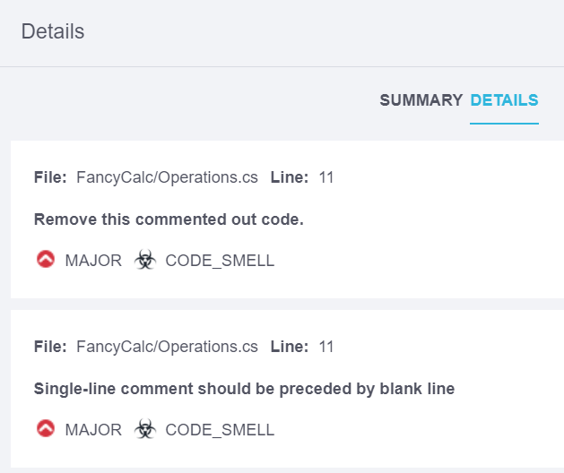

38. Перекомпилируйте решение и откройте пунель "Eror List" снова. Сейчас панель не имеет предупреждений.


39. Если у вас в Visual Studio установлено расширение, Visual Studio подчеркнет волнистой линией слово "TODO" в окне редактора. Это предупреждение сгенерировано [правилом S1135](https://rules.sonarsource.com/csharp/RSPEC-1135).

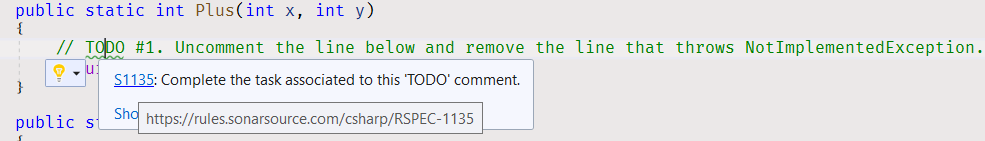

Описание правила указывает:

_TODO Теги обычно используются для обозначения мест, где требуется еще немного кода, но который разработчик хочет реализовать позже. Иногда у разработчика не будет времени или он просто забудет вернуться к этому тегу. Это правило предназначено для отслеживания этих тегов и обеспечения того, чтобы они не остались незамеченными._

40. Удалите все строки комментариев со словом "TODO", чтобы устранить проблемы.

```cs
public static int Plus(int x, int y)
{
    return x + y;
}
```

Если вы оставите комментарий TODO в вашем коде, то Sonar вызовет проблемы, когда вы запустите проверку задачи в AutoCode.


## Исправьте проблемы компилятора

Для проектов в этом решении включены дополнительные проверки стиля и кода. Они помогут Вам поддерживать согласованность исходного кода проекта и избегать глупых ошибок. [Просмотрите список ошибок](https://docs.microsoft.com/ru-ru/visualstudio/ide/find-and-fix-code-errors#review-the-error-list) в Visual Studio, чтобы увидеть все предупреждения и ошибки компилятора.

Если текст ошибки или предупреждения компилятора Вам не ясен, [просмотрите подробные сведения об ошибке](https://docs.microsoft.com/ru-ru/visualstudio/ide/find-and-fix-code-errors#review-errors-in-detail) или введите в поиске google код ошибки или предупреждения, чтобы получить больше информации о проблеме.

Также, вы можете использовать [Базу знаний правил Sonar](https://rules.sonarsource.com/csharp) для поиска более детальной информации касательно обнаруженных предупреждений Sonar.


## Проблемы Sonar

Если вы оставите строку с комментарием "TODO" или любые закомментированные строки кода, у вас возникнут проблемы с Sonar во время проверки задачи.


Чтобы получить более высокую оценку устраните эти проблемы и снова запустите проверку задачи.


## Сохраните вашу работу

* [Пересоберите решение](https://docs.microsoft.com/ru-ru/visualstudio/ide/building-and-cleaning-projects-and-solutions-in-visual-studio) в Visual Studio.
* Проверьте [окно Error List](https://docs.microsoft.com/ru-ru/visualstudio/ide/reference/error-list-window) на ошибки и предупреждения компилятора. Если у вас имеются какие-либо ошибки и предупреждения, **исправьте проблемы** и перекомпилируйте решение снова.
* [Запустите все юнит-тесты в Test Explorer](https://docs.microsoft.com/ru-ru/visualstudio/test/run-unit-tests-with-test-explorer) и удостоверьтесь, что **нет проваленных юнит-тестов**. Исправьте ваш код, [чтобы сделать все юнит-тесты ЗЕЛЕНЫМИ](https://stackoverflow.com/questions/276813/what-is-red-green-testing).
* Просмотрите все изменения **до** сохранения вашей работы.
    * Откройте вкладку "Changes" в [Team Explorer](https://docs.microsoft.com/ru-ru/visualstudio/ide/reference/team-explorer-reference).
    * Нажмите правой кнопкой мыши на измененном файле.
    * Нажмите пункт меню "Compare with Unmodified", чтобы открыть окно сравнения.
* [Подготовьте изменения](https://docs.microsoft.com/ru-ru/azure/devops/repos/git/commits#stage-your-changes) и [создайте коммит](https://docs.microsoft.com/ru-ru/azure/devops/repos/git/commits#create-a-commit).
* Поделитесь вашими изменениями, [отправив их на удаленный репозиторий](https://docs.microsoft.com/ru-ru/azure/devops/repos/git/pushing).


## Дополнительная информация

* Visual Studio
  * [Знакомство с отладчиком Visual](https://docs.microsoft.com/ru-ru/visualstudio/debugger/debugger-feature-tour)
  * [Краткое руководство: Отладка кода C# или Visual Basic с помощью отладчика Visual Studio](https://docs.microsoft.com/ru-ru/visualstudio/debugger/quickstart-debug-with-managed)
  * [Учебник. Сведения об отладке кода C# с помощью Visual Studio](https://docs.microsoft.com/ru-ru/visualstudio/get-started/csharp/tutorial-debugger)
  * [Переходите по коду с помощью отладчика Visual Studio](https://docs.microsoft.com/ru-ru/visualstudio/debugger/navigating-through-code-with-the-debugger)
  * [Сочетания клавиш по умолчанию в Visual Studio](https://docs.microsoft.com/ru-ru/visualstudio/ide/default-keyboard-shortcuts-in-visual-studio)
