# Fancy Calculator

Beginner level task to practice debugging unit tests in Visual Studio.

Translations: [Russian](README-RU.md).

Estimated time to complete the task - 0.5h.

The task requires .NET 6 SDK installed.


## SonarLint

We recommend you to install [SonarLint extension for Visual Studio](https://www.sonarlint.org/visualstudio). This extension is very useful during the development because it detects code quality and code security issues on the fly and highlights these issues in the Visual Studio code editor.

1. Open "Extensions" window by clicking on the _Extensions\Manage Extensions_ menu item.

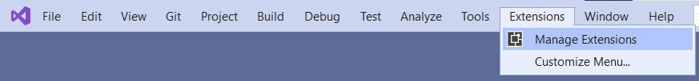

2. Search for "SonarLint" extension in the search bar and download the extension.

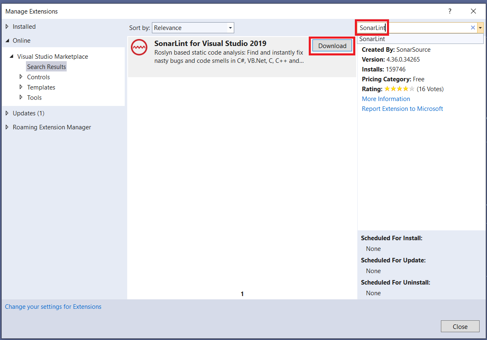

3. Visual Studio needs restart. Close the application.

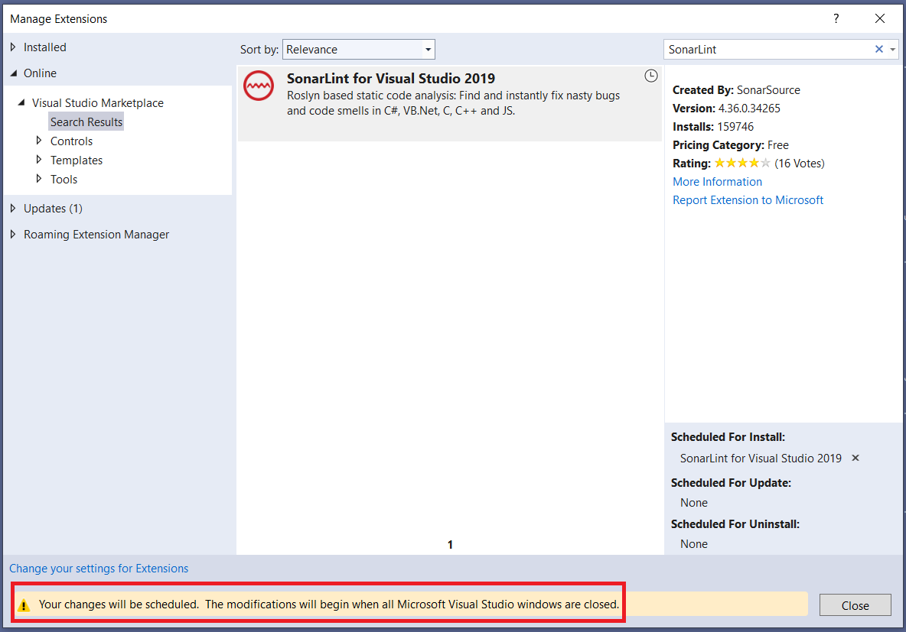

4. An extension installer window will appear. Click on "Modify" button.

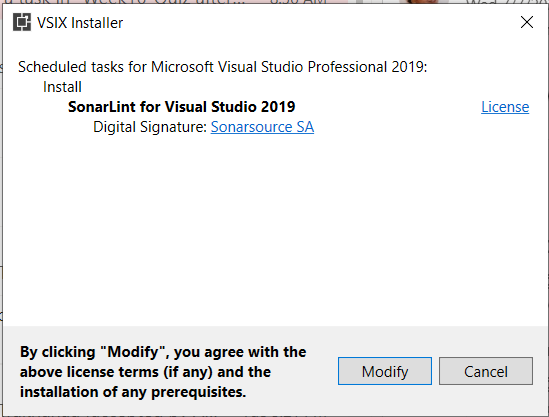

5. When the "SonarLint" extension will be installed, start the application again. Now Visual Studio will highlignt the issues detected by Sonar in the code editor window by wavy underline.

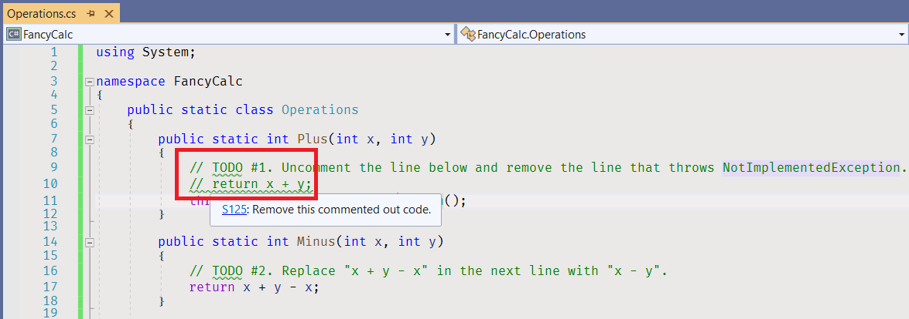


## Complete the Task

1. [Build the solution](https://docs.microsoft.com/en-us/visualstudio/ide/building-and-cleaning-projects-and-solutions-in-visual-studio).
    * Click on the menu item - _Build\Build Solution_.
    * Or use the default keyboard shortcut - _Ctrl+Shift+B_.

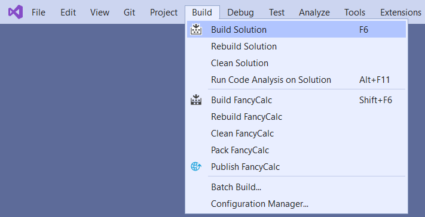

2. Open the [Test Explorer](https://docs.microsoft.com/ru-ru/visualstudio/test/run-unit-tests-with-test-explorer) view.
    * Click on the menu item - _View\Test Explorer_.
    * Or use the default keyboard shortcut - _Ctrl+E, T_.

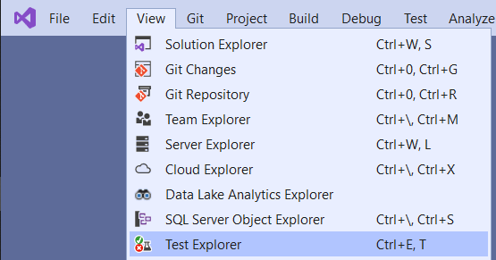

3. Run all unit tests. There are 20 unit tests in the project, at least 15 unit tests in Test Explorer should be "red".
    * Click on the menu item - _Test\Run All Tests_.
    * Or use the defaul keyboard shortcut - _Ctrl+R, A_.

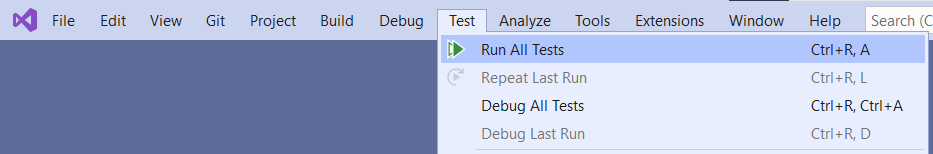

4. Double click on "Plus_WithOneAndOne_ReturnsTwo" unit test. Visual Studio will open the code editor window for [OperationsTests.cs](FancyCalc.Tests/OperationsTests.cs) file, and will navigate you to the unit test code.

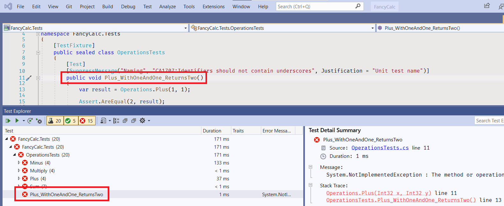

5. Navigate to "Operations.Plus" method code.
    * Right click on the method name "Plus" in line 13, and click on "Go to Definition" menu item.
    * Or click on the method name "Plus" in line 13, and use the default shortcut _F12_.
    * Or click on the method name "Plus" in line 13 pressing the _Ctrl_ key.

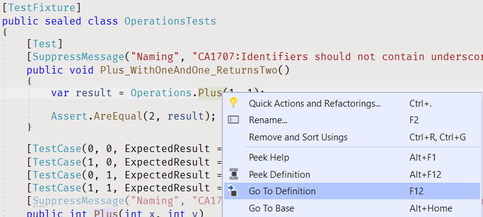

6. Visual Studio will open the editor window for [Operations.cs](FancyCalc/Operations.cs) file, and will navigate you to the method code.

7. Go to line 10.
    * Use cursor keys.
    * Or use the default shortcut - _Ctrl+G_, press 10, and press Enter key.


8. Uncomment the current line.
    * Use the default shortcut - _Ctrl+K, Ctrl+U_.

```cs
public static int Plus(int x, int y)
{
    // TODO #1. Uncomment the line below and remove the line that throws NotImplementedException.
    return x + y;
    throw new NotImplementedException();
}
```

9. Go to the next line - line 11.
10. Comment the current line.
    * Use the default shortcut - _Ctrl+K, Ctrl+C_.

```cs
public static int Plus(int x, int y)
{
    // TODO #1. Uncomment the line below and remove the line that throws NotImplementedException.
    return x + y;
    //throw new NotImplementedException();
}
```

11. Open the Test Explorer view, run all unit tests. All "Plus" unit tests and "Plus_WithOneAndOne_ReturnsTwo" unit test are "green" now.

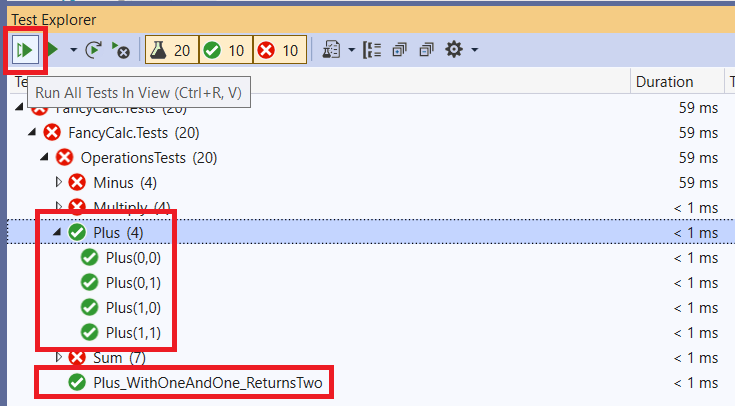

12. Inspect "Minus" unit tests in the test list. Only one unit test should be "green", the others — "red".

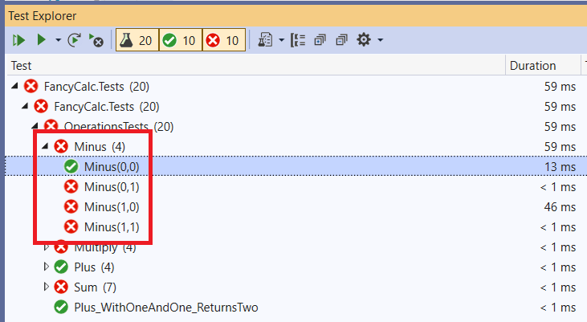

13. Navigate to the unit test code and then navigate to the "Minus" method code in the [Operations.cs](FancyCalc/Operations.cs) file.

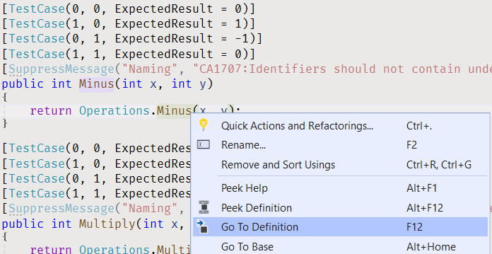

14. Fix the "Minus" method code according to the TODO comment.

```cs
public static int Minus(int x, int y)
{
    // TODO #2. Replace "x + y - x" in the next line with "x - y".
    return x - y;
}
```

15. Open the Test Explorer view, click on the "Minus (4)" line, and run all "Minus" unit tests right clicking on the menu item. All "Minus" unit tests should be green now.

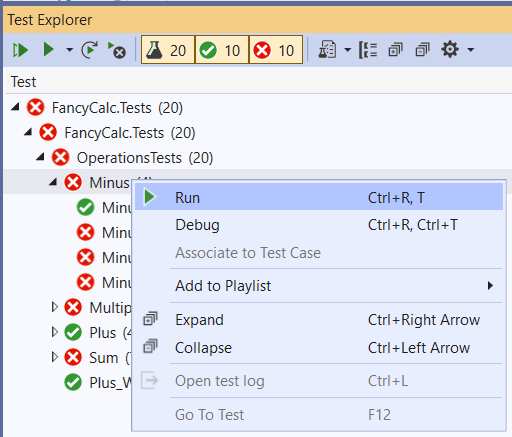

16. Navigate to the "Multiply" unit test, and then to the "Multiply" method code in the [Operations.cs](FancyCalc/Operations.cs) file.

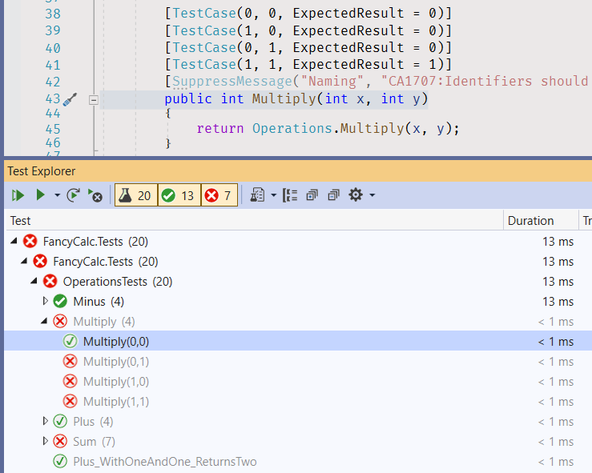

17. Add a breakpoint to line 23.
    * Click on the gutter for line 23.
    * Or use the default shortcut - _F9_.

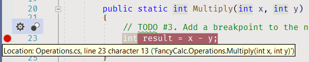

18. Open the Test Explorer view, and run the "green" "Multiply(0, 0)" unit test in the debug mode.
    * Right click on the "Multiply" unit test, and click on the "Debug" menu item.
    * Or use the default shortcut - _Ctrl+R, T_.

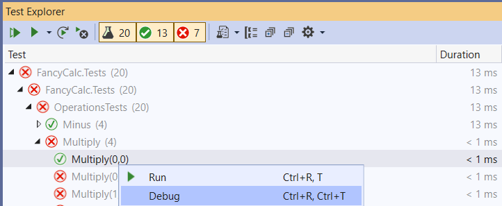

19. Trace the program execution.
    * Click on the "Debug\Step Over" menu item.
    * Or use the default shortcut - _F10_.
    * Or use the menu bar icon in the "Debug" panel.

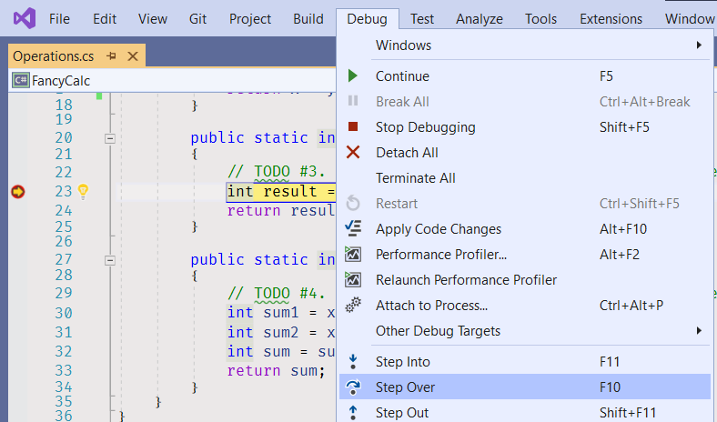

20. Inspect the "result" variable.
    * Hover the "result" variable name on line 24 with your mouse.

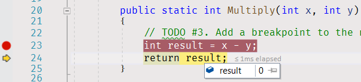

21. Stop Debugging.
    * Click on the "Debug\Stop Debugging" menu item.
    * Or use the default shortcut - _Shift+F5_.

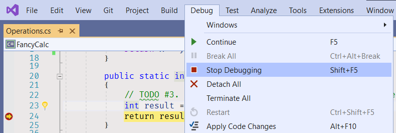

22. Remove the breakpoint on line 23, and add a breakpoint to line 24.

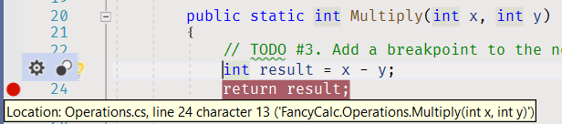

23. Run the "red" "Multiply(0, 1)" unit test in the debug mode again.

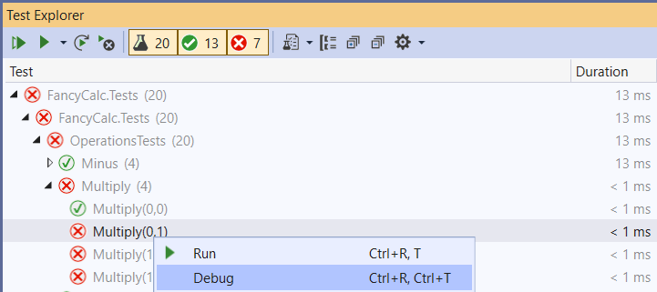

24. Inspect the "result" variable.

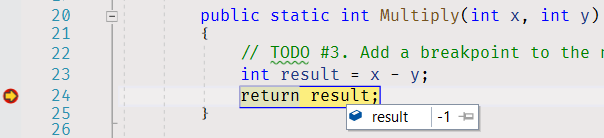

25. Continue the program execution.
    * Click on the "Debug\Continue" menu item.
    * Or use the default shortcut - _F5_.
    * Or use the menu bar icon in the "Debug" panel.

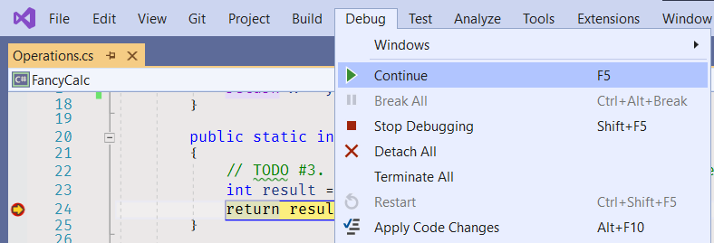

26. Fix the "Multiply" method code.

```cs
public static int Multiply(int x, int y)
{
    // TODO #3. Add a breakpoint to the next line, run the unit test in the debug mode, and inspect the result during the program execution.
    int result = x * y;
    return result;
}
```

27. Open the Test Explorer view and run all "Multiply" unit tests again. "Multiply" unit tests should be "green" now.

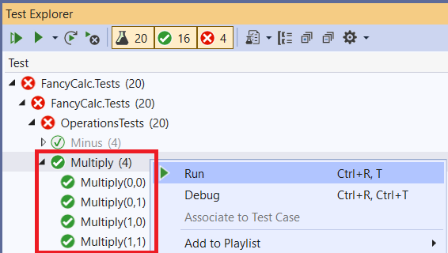

28. Open the Test Explorer view and run all "Sum" unit tests. Some unit tests should be "red".

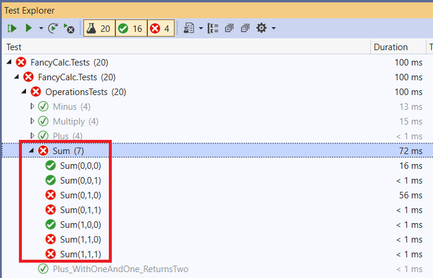

29. Add a breakpoint to line 30.

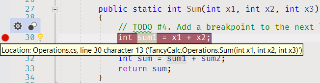

30. Run one of the failed unit tests in the debug mode.

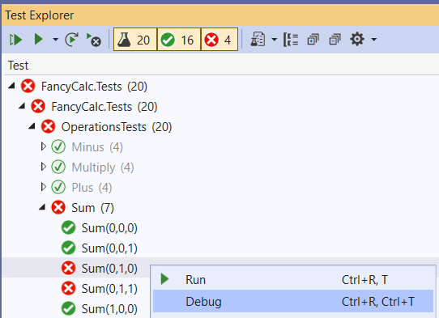

31. Trace the program execution to find the problem.
32. Fix the code.

```cs
public static int Sum(int x1, int x2, int x3)
{
    // TODO #4. Add a breakpoint to the next line, run the unit test in the debug mode, and trace the program execution.
    int sum1 = x1 + x2;
    int sum = sum1 + x3;
    return sum;
}
```

33. Open the Test Explorer view and run all "Sum" unit tests. "Sum" unit tests should be "green" now.

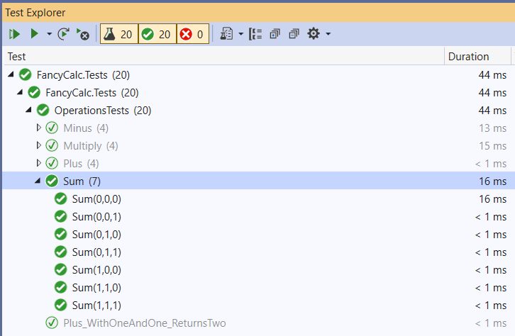

34. Run all unit tests and make sure all of them are "green".

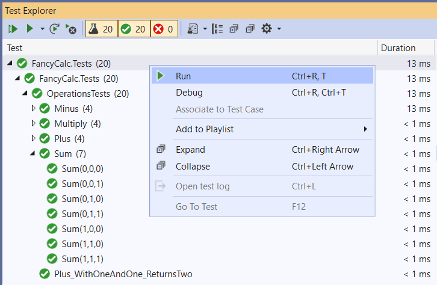

35. Rebuild the solution.
    * Click on the menu item - _Build\Rebuild Solution_.

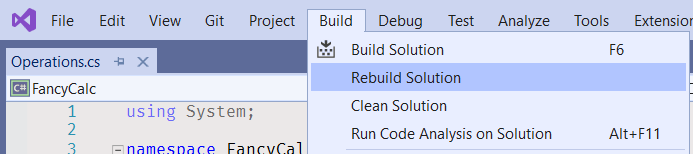

36. Open the "Error List" pane. The pane has two warnings.
    * Click on the "View\Error List" menu item.
    * Or use the default shortcut - _Ctrl+W, E_.

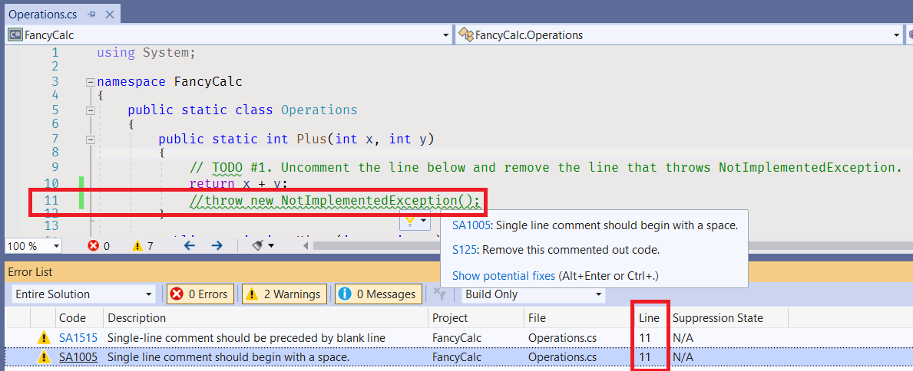

37. Remove line 11.

```cs
public static int Plus(int x, int y)
{
    // TODO #1. Uncomment the line below and remove the line that throws NotImplementedException.
    return x + y;
}
```

If you leave this comment in your code, the Sonar will raise issues when you will initiate the task check in AutoCode.

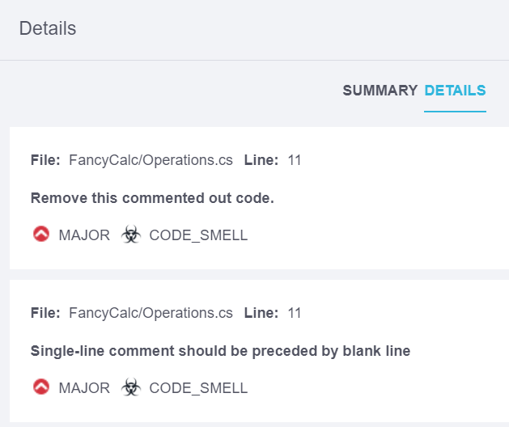

38. Rebuild the solution and open the "Eror List" pane again. The pane has no warnings now.

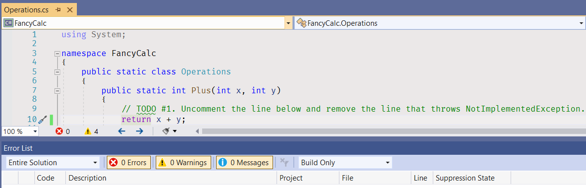

39. If you have SonarLint extension installed in your Visual Studio, the Visual Studio will mark a "TODO" word in the code editor window with a wavy underline. This is the warning generated by [S1135 rule](https://rules.sonarsource.com/csharp/RSPEC-1135).

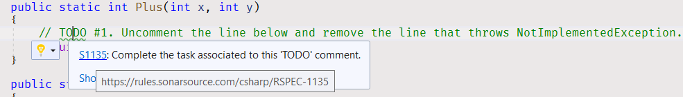

The rule description says:

_TODO tags are commonly used to mark places where some more code is required, but which the developer wants to implement later. Sometimes the developer will not have the time or will simply forget to get back to that tag. This rule is meant to track those tags and to ensure that they do not go unnoticed._

40. Remove all comment lines with "TODO" word to fix the issues.

```cs
public static int Plus(int x, int y)
{
    return x + y;
}
```

If you leave "TODO" in your code, the Sonar will raise an issue when you will initiate the task check in AutoCode.

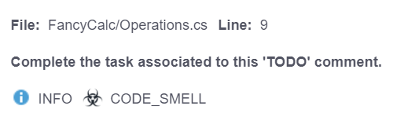


## Fix Compiler Issues

Additional style and code checks are enabled for the projects in this solution to help you maintain consistency of the project source code and avoid silly mistakes. [Review the Error List](https://docs.microsoft.com/en-us/visualstudio/ide/find-and-fix-code-errors#review-the-error-list) in Visual Studio to see all compiler warnings and errors.

If a compiler error or warning message is not clear, [review errors details](https://docs.microsoft.com/en-us/visualstudio/ide/find-and-fix-code-errors#review-errors-in-detail) or google the error or warning code to get more information about the issue.

Also, you can use [Sonar rule knowledge database](https://rules.sonarsource.com/csharp) for searching more detailed information regarding detected Sonars' issues.


## Save Your Work

* [Rebuild your solution](https://docs.microsoft.com/en-us/visualstudio/ide/building-and-cleaning-projects-and-solutions-in-visual-studio) in Visual Studio.
* Check out the [Error List window](https://docs.microsoft.com/en-us/visualstudio/ide/reference/error-list-window) for compiler errors and warnings. If you have any of those issues, **fix the issues** and rebuild the solution again.
* [Run all unit tests with Test Explorer](https://docs.microsoft.com/en-us/visualstudio/test/run-unit-tests-with-test-explorer) and make sure there are **no failed unit tests**. Fix your code to [make all your unit tests GREEN](https://stackoverflow.com/questions/276813/what-is-red-green-testing).
* Review all your changes **before** saving your work.
    * Open the "Changes" view in [Team Explorer](https://docs.microsoft.com/en-us/visualstudio/ide/reference/team-explorer-reference).
    * Right click on a modified file.
    * Click on "Compare with Unmodified" menu item to open a comparison window.
* [Stage your changes](https://docs.microsoft.com/en-us/azure/devops/repos/git/commits#stage-your-changes) and [create a commit](https://docs.microsoft.com/en-us/azure/devops/repos/git/commits#create-a-commit).
* Share your changes by [pushing them to a remote repository](https://docs.microsoft.com/en-us/azure/devops/repos/git/pushing).


## Sonar Issues

If you left a comment line with "TODO" word in your code or any commented code lines, you will get Sonar issues during the task check.

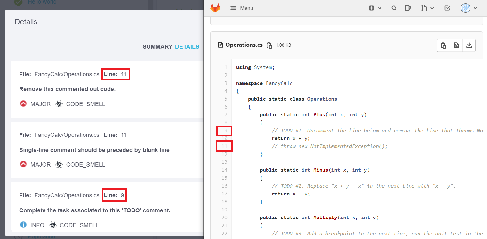

To get a higher score, fix these issues and start check the task again.


## See also

* Visual Studio
  * [First look at the Visual Studio Debugger](https://docs.microsoft.com/en-us/visualstudio/debugger/debugger-feature-tour)
  * [Quickstart: Debug with C# or Visual Basic using the Visual Studio debugger](https://docs.microsoft.com/en-us/visualstudio/debugger/quickstart-debug-with-managed)
  * [Tutorial: Learn to debug C# code using Visual Studio](https://docs.microsoft.com/en-us/visualstudio/get-started/csharp/tutorial-debugger)
  * [Navigate through code with the Visual Studio debugger](https://docs.microsoft.com/en-us/visualstudio/debugger/navigating-through-code-with-the-debugger)
  * [Default keyboard shortcuts in Visual Studio](https://docs.microsoft.com/en-us/visualstudio/ide/default-keyboard-shortcuts-in-visual-studio)
