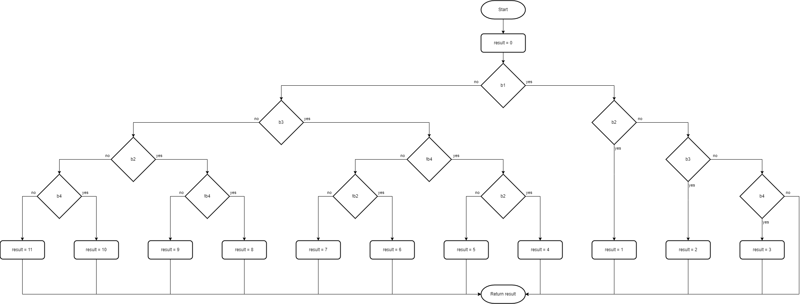

# If-Else Statements

Beginner level task for practicing conditionals and if-else statements.

Estimated time to complete the task - 3h.

The task requires .NET 6 SDK installed.


## Task Description

The task has eight sub-tasks. Each sub-task is a small coding exercise.

Basic understanding of [flowchart diagrams](https://en.wikipedia.org/wiki/Flowchart) (или см. русскоязычную [статью Блок-схема](https://ru.wikipedia.org/wiki/%D0%91%D0%BB%D0%BE%D0%BA-%D1%81%D1%85%D0%B5%D0%BC%D0%B0)) is required to successfully complete the task. If you are not familiar with flowchart diagrams, read the Wikipedia article first.


### Sub-task 1

In this sub-task you have to implement the [DoSomething](IfElseStatements/Task1.cs#L5) static method that belongs to the _Task1_ class. In the method code use _if_ statements **without** the _else_ part. The algorithm you have implement is shown on the flowchart diagram below.


Analyze the diagram and add the code to the _DoSomething_ method. Run the unit tests in the [Task1Tests](IfElseStatements.Tests/Task1Tests.cs#L6) class to make sure your code conforms the expected criteria.

The expected results table has the method outputs for different values of the _b_ input parameter. The expected method outputs are implemented as test cases for the method [unit test](IfElseStatements.Tests/Task1Tests.cs#L10).

| b     | Expected Result |
|-------|-----------------|
| true  | 123             |
| false | -123            |

The code you have to implement should be similar to this code snippet:

```cs
public static int DoSomething(bool b)
{
    int result = 0;

    if (b)
    {
        result = 123;
    }

    if (!b)
    {
        result = -123;
    }

    return result;
}
```

Identical results can be obtained by implementing an algorithm using the _if_ statement **with** an _else_ part.

[Refactor](https://en.wikipedia.org/wiki/Code_refactoring) the method code: replace the second _if_ statement with an _else_ part.

```cs
public static int DoSomething(bool b)
{
    int result = 0;

    if (b)
    {
        result = 123;
    }
    else
    {
        result = -123;
    }

    return result;
}
```

Now the algorithm conforms to the flowchart below.


### Sub-task 2

Implement the [DoSomething1](IfElseStatements/Task2.cs#L5) method in the _Task2_ class using _if_ statements **without** _else_ parts. The flowchart below shows the algorithm the code should conform to.


The expected results table has the method outputs for different values of the _b1_ and _b2_ input parameters. The expected method outputs are used as test cases for the method [unit test](IfElseStatements.Tests/Task2Tests.cs#L12).

| b1    | b2    | Expected Result |
|-------|-------|-----------------|
| true  | true  | 123             |
| true  | false | -345            |
| false | true  | -567            |
| false | false | 789             |

Identical results can be obtained by implementing an algorithm using the _if_ statement **with** an _else_ part.


Implement the [DoSomething2](IfElseStatements/Task2.cs#L11) method in the _Task2_ class using an _if-else_ statement. The code should conform to the algorithm on the flowchart above.

_DoSomething1_ and _DoSomething2_ methods have similar algorithms and they produce the identical results for same input parameter values.


### Sub-task 3

Implement the [DoSomething1](IfElseStatements/Task3.cs#L5) method in the _Task3_ class using the _if_ statement **without** an _else_ part. The flowchart below shows the algorithm the code should conform to.


The expected results table has the method outputs for various values of the _b_ and _i_ input parameters. The expected method outputs are used as test cases for the method [unit test](IfElseStatements.Tests/Task3Tests.cs#L50).

| b     | i               | Expected Result |
|-------|-----------------|-----------------|
| true  | (-&infin;, -6]  | i - 10          |
| true  | (-6, &infin;)   | i + 1           |
| false | (-&infin;, 8)   | i - 1           |
| false | [8, &infin;)    | i + 10          |

[The standard notation for math intervals](https://en.wikipedia.org/wiki/Interval_(mathematics)) is used to specify ranges for integer parameters. Infinity signs (-&infin; and &infin;) are usedd to specify the parameter maximum and minimum values.

Identical results can be obtained by implementing an algorithm using the _if_ statement **with** an _else_ part.


Implement the [DoSomething2](IfElseStatements/Task3.cs#L11) method in the _Task3_ class using an _if-else_ statement. The code should conform to the algorithm on the flowchart above.

_DoSomething1_ and _DoSomething2_ methods have similar algorithms and they produce the identical result for same input parameter values.


### Sub-task 4

Fix logical bugs in the [DoSomething](IfElseStatements/Task4.cs#L5) method in the _Task4_ class. The _if-else_ expressions have logical mistakes because of incorrect use of the [logical negation operator !](https://docs.microsoft.com/en-us/dotnet/csharp/language-reference/operators/boolean-logical-operators#logical-negation-operator-). In some cases the logical expression has an unnecessary negation operator or misses the required operator.

Inspect the behavior of the highlighted decision blocks, and modify conditional expressions to conform to all test cases.


The expected results table has the method outputs for various values of the _b1_, _b2_, _b3_ and _b4_ input parameters. The expected method outputs are used as test cases for the method [unit test](IfElseStatements.Tests/Task4Tests.cs#L24).

| b1    | b2    | b3    | b4    | Expected Result |
|-------|-------|-------|-------|-----------------|
| false | false | false | false | 5               |
| true  | false | false | false | 2               |
| false | true  | false | false | 5               |
| true  | true  | false | false | 2               |
| false | false | true  | false | 6               |
| true  | false | true  | false | 3               |
| false | true  | true  | false | 6               |
| true  | true  | true  | false | 2               |
| false | false | false | true  | 8               |
| true  | false | false | true  | 1               |
| false | true  | false | true  | 5               |
| true  | true  | false | true  | 1               |
| false | false | true  | true  | 7               |
| true  | false | true  | true  | 4               |
| false | true  | true  | true  | 6               |
| true  | true  | true  | true  | 1               |

An _if-else_ statement is called **nested** if the statement is inside the code block of another _if_ statement.

```cs
if (condition1)
{
    // nested if
    if (condition2)
    {
        // do one thing
    }
}
else
{
    // nested if
    if (condition3)
    {
        // do another thing
    }
}
```

Control structures in C# can be nested to as many levels as you want.


### Sub-task 5

Implement the [DoSomething1](IfElseStatements/Task5.cs#L5) method in the _Task5_ class using the _if_ statement **with** an _else_ part. The flowchart below shows the algorithm the code should conform to.



The expected results table has the method outputs for different values of the _b1_, _b2_, _b3_ and _b4_ input parameters. The expected method outputs are used as test cases for the method [unit test](IfElseStatements.Tests/Task5Tests.cs#L24).

| b1    | b2    | b3    | b4    | Expected Result |
|-------|-------|-------|-------|-----------------|
| false | false | false | false | 11              |
| true  | false | false | false | 0               |
| false | true  | false | false | 8               |
| true  | true  | false | false | 1               |
| false | false | true  | false | 5               |
| true  | false | true  | false | 2               |
| false | true  | true  | false | 4               |
| true  | true  | true  | false | 1               |
| false | false | false | true  | 10              |
| true  | false | false | true  | 3               |
| false | true  | false | true  | 9               |
| true  | true  | false | true  | 1               |
| false | false | true  | true  | 6               |
| true  | false | true  | true  | 2               |
| false | true  | true  | true  | 7               |
| true  | true  | true  | true  | 1               |

In the following example, the _else_ part of the first _if_ statement contains another nested _if-else_ statement. This nested _if-else_ statement has yet another _if-else_ statement in the _else_ part.

```cs
if (condition1)
{
    Foo();
}
else
{
    Bar();

    if (condition2)
    {
        Baz();

        if (condition3)
        {
            Faz();
        }
        else
        {
            Boo();
        }
    }
    else
    {
        Far();
    }
}
```

Sometimes using **cascading** _if-else_ statements makes the code much more readable rather than compared to the code with nested _if-else_ statements. A cascading _if-else_ is a composite of if-else statements where the _else_ part of the outer _if_ statement is a nested _if-else_ statement.

```cs
if (condition1)
{
    Foo();
}
else if (condition2 && condition3)
{
    Bar();
    Baz();
    Faz();
}
else if (condition2)
{
    Bar();
    Baz();
    Boo();
}
else
{
    Bar();
    Far();
}
```

The code in both snippets is logically equivalent. If you need more information about nested and cascading if statements, see [Decision Making in C/C++](https://www.geeksforgeeks.org/decision-making-c-c-else-nested-else/) article and the [discussions on Stackoverflow](https://stackoverflow.com/search?q=if+cascaded+nested).

The algorithm you implemented in _DoSomething_ method earlier can be implemented using cascading _if-else_ statements.


Add the code to the [DoSomething2](IfElseStatements/Task5.cs#L11) method in the _Task5_ class using **cascading** _if-else_ statements. The code should conform to the algorithm on the flowchart above. In this task a decision block on a flowchart has expressions connected with _AND_ and _OR_. In C# code files use respective [Boolean logic operator](https://docs.microsoft.com/en-us/dotnet/csharp/language-reference/operators/boolean-logical-operators) as logical connective.

_DoSomething1_ and _DoSomething2_ methods have similar algorithms and they produce identical results for same input parameter values.


### Sub-task 6

Implement the [DoSomething](IfElseStatements/Task6.cs#L5) method in the _Task6_ class using **cascading** _if-else_ statements. The flowchart below shows the algorithm the code should conform to.


The expected results table has the method outputs for various values of the _i_ input parameter. The expected method outputs are used as test cases for the method [unit test](IfElseStatements.Tests/Task6Tests.cs#L29).

| i               | Expected Result  |
|-----------------|------------------|
| (-&infin;, -8)  | i * i            |
| [-8, -2]        | i * 3            |
| (-2, 3]         | i * 2 + i * i    |
| (3, 7)          | i * (i - 1) * -1 |
| [7, &infin;)    | i * 2            |


### Sub-task 7

Analyze the algorithm shown on the flowchart below and figure out which statements can be used to implement the algorithm (_if_ or _if-else_).


Implement the [DoSomething](IfElseStatements/Task7.cs#L5) method in the _Task7_ class using the similar algorithm, but only with **cascading** _if-else_ statements. For the expected method output values see test cases for the method [unit test](IfElseStatements.Tests/Task7Tests.cs#L50).


### Sub-task 8

The algorithm shown on the flowchart below is implemented using cascading _if-else_ statements. 


Analyze the algorithm and implement the [DoSomething](IfElseStatements/Task7.cs#L5) method in the _Task7_ class with **nested** _if-else_ statements. For the expected method output values see test cases for the method [unit test](IfElseStatements.Tests/Task8Tests.cs#L450).


## Fix Compiler Issues

Additional style and code checks are enabled for the projects in this solution to help you maintaining consistency of the project source code and avoiding silly mistakes. [Review the Error List](https://docs.microsoft.com/en-us/visualstudio/ide/find-and-fix-code-errors#review-the-error-list) in Visual Studio to see all compiler warnings and errors.

If a compiler error or warning message is not clear, [review errors details](https://docs.microsoft.com/en-us/visualstudio/ide/find-and-fix-code-errors#review-errors-in-detail) or google the error or warning code to get more information about the issue.


## Task Checklist

1. Rebuild the solution.
1. Fix all compiler warnings and errors.
1. Run all unit tests, make sure all unit tests completed successfully.
1. Review all changes, make sure the only code files (.cs) in IfElseStatements project have changes. No changes in project files (.csproj) or in IfElseStatements.Tests project.
1. Stage your changes, and create a commit.
1. Push your changes to remote repository.


## See also

* C# Language Reference
  * [The if statement](https://docs.microsoft.com/en-us/dotnet/csharp/language-reference/statements/selection-statements#the-if-statement)
  * [Boolean logical operators](https://docs.microsoft.com/en-us/dotnet/csharp/language-reference/operators/boolean-logical-operators)
