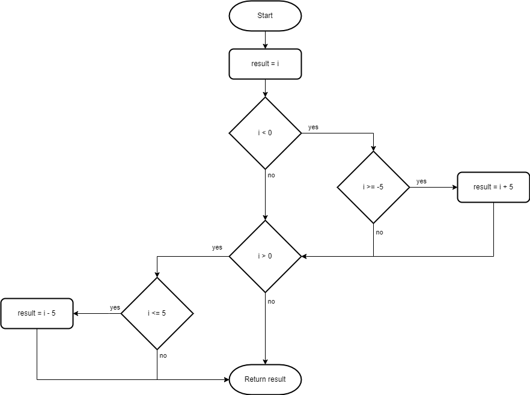

# If Statements

Beginner level task for practicing conditionals and if statements.

Estimated time to complete the task - 4h.

The task requires .NET 6 SDK installed.


## Task Description

The task has fourteen sub-tasks. Each sub-task is a small coding exercise.

Basic understanding of [flowchart diagrams](https://en.wikipedia.org/wiki/Flowchart) (или см. русскоязычную [статью Блок-схема](https://ru.wikipedia.org/wiki/%D0%91%D0%BB%D0%BE%D0%BA-%D1%81%D1%85%D0%B5%D0%BC%D0%B0)) is required to successfully complete the task. If you are not familiar with flowchart diagrams, read the Wikipedia article first.

In this task use the only *if* keyword for selection statements. Using *else* or *switch* keywords is not required.


### Sub-task 1

In this sub-task you have to implement the [DoSomething](IfStatements/Task1.cs#L5) static method that belongs to the _Task1_ class. The algorithm you have implement is shown on the flowchart diagram below.


Read and understand the diagram, and add the code to the _DoSomething_ method. Run the unit tests in the [Task1Tests](IfStatements.Tests/Task1Tests.cs#L6) class to make sure your code conforms to the expected criteria.

The expected results table has the method outputs for different values of the _i_ input parameter. [The standard notation for math intervals](https://en.wikipedia.org/wiki/Interval_(mathematics)) is used to specify ranges for integer parameters. We use infinity signs (-&infin; and &infin;) to specify the parameter's minimum and maximum values.

| i Interval      | Expected Result |
|-----------------|-----------------|
| (-&infin;, 0)   | 0               |
| [0, &infin;)    | i               |


#### Sub-task 1 Tutorial

This step-by-step tutorial shows how to solve the sub-task.

1. Process block "result = i".


Declare a new variable with _result_ name. The variable should have the same value as the _i_ parameter.

```cs
public static int DoSomething(int i)
{
    int result = i;
}
```

2. Decision block "result < 0".


Add [if statement](https://docs.microsoft.com/en-us/dotnet/csharp/language-reference/statements/selection-statements#the-if-statement) with _result < 0_ condition and an empty code block ({}).

```cs
public static int DoSomething(int i)
{
    int result = i;

    if (result < 0)
    {
    }
}
```

In this task the decision block on the flowchart may have expressions connected with _AND_ and _OR_. In C# code files code use respective [Boolean logic operator](https://docs.microsoft.com/en-us/dotnet/csharp/language-reference/operators/boolean-logical-operators) as logical connective.

3. Process block "result = 0".


Assign a zero value to the _result_ variable in the code block.

```cs
public static int DoSomething(int i)
{
    int result = i;

    if (result < 0)
    {
        result = 0;
    }
}
```

4. Terminal block "Return result".


Return the value of the _result_ variable with a [return statement](https://docs.microsoft.com/en-us/dotnet/csharp/language-reference/statements/jump-statements#the-return-statement).

```cs
public static int DoSomething(int i)
{
    int result = i;

    if (i < 0)
    {
        result = 0;
    }

    return result;
}
```


### Sub-task 2

Implement the [DoSomething1](IfStatements/Task2.cs#L5) method in the _Task2_ class. The flowchart below shows the algorithm the code should conform to.


The expected result table has the method outputs for different values of the _i_ input parameter.

| i Interval      | Expected Result |
|-----------------|-----------------|
| (-&infin;, -5)  | 0 - i * i       |
| [-5, 0)         | 0 - i           |
| [0, &infin;)    | i               |

Identical results can be obtained if [return statement](https://docs.microsoft.com/en-us/dotnet/csharp/language-reference/statements/jump-statements#the-return-statement) is included in other blocks of “if..else” statement.


Implement the [DoSomething2](IfStatements/Task2.cs#L11) method in the _Task2_ class including a _return_ statement in respective blocks of "if..else" statement. The code should conform to the algorithm on the flowchart above.

The _DoSomething1_ and the _DoSomething2_ methods have similar algorithms and they produce the identical results for same input parameter values.


### Sub-task 3

Implement the [DoSomething1](IfStatements/Task3.cs#L5) method in the _Task3_ class. The flowchart below shows the algorithm the code should conform to.


The expected result table has the method outputs for different values of the _b_ input parameter.

| b     | Expected Result |
|-------|-----------------|
| true  | false           |
| false | true            |

The expression in the decision block is a [constant pattern](https://docs.microsoft.com/en-us/dotnet/csharp/language-reference/operators/patterns#constant-pattern). The _constant pattern_ tests if an expression result equals to a specified constant.

```cs
if (b is true)
{
    ...
}
```

This code snippet tests if _b_ equals to _true_.

Identical results can be obtained if a _return_ statement is included in other blocks of “if..else” statement.


Pay attention to the syntax of the condition expression in the _if statement_ (“if (b)”) as opposed to “if (b is true)”.  “if (b)” is the most preferred and common syntax in C# code.

C# has a few options for testing if an expression result is true:

```cs
// The most preferred and common syntax.
if (b)
{
    ...
}

// Constant pattern syntax - verbose and not common.
if (b is true)
{
    ...
}

// Verbose and not common for bool type, but good option for bool? type.
if (b == true)
{
    ...
}
```

All these options are syntactically correct and work in the same way. We recommend to use the most common syntax "if (b)" in this task. Check the [Check if boolean is true?](https://stackoverflow.com/questions/3685002/check-if-boolean-is-true) discussion for more details.

Implement the [DoSomething2](IfStatements/Task3.cs#L11) method in the _Task3_ class using a _return_ statement. The code should conform to the algorithm on the flowchart above.

The _DoSomething1_ and the _DoSomething2_ methods have similar algorithms and they produce identical result for same input parameter values.


### Sub-task 4

Implement the [DoSomething1](IfStatements/Task4.cs#L5) method in the _Task4_ class. The flowchart below shows the algorithm the code should conform to.


The expected result table has the method outputs for different values of the _b1_ and _b2_ input parameters.

| b1    | b2    | Expected Result |
|-------|-------|-----------------|
| true  | true  | false           |
| false | true  | true            |
| true  | false | true            |
| false | false | false           |

Identical results can be obtained if a _return_ statement is included in other blocks of “if..else” statement.


Notice that the nested _if_ equals to an _if_ statement with complex logical expression with [logical AND operator](https://docs.microsoft.com/en-us/dotnet/csharp/language-reference/operators/boolean-logical-operators):

```cs
if (expression1)
{
    if (expression2)
    {
        ...
    }
}

// equals to

if (expression1 & expression2)
{
    ...
}
```

Implement the [DoSomething2](IfStatements/Task4.cs#L11) method in the _Task4_ class using a _return_ statement. The code should conform to the algorithm on the flowchart above.

_DoSomething1_ and _DoSomething2_ methods have similar algorithms and they produce identical results for same input parameter values.


### Sub-task 5

Implement the [DoSomething](IfStatements/Task5.cs#L5) method in the _Task5_ class. The flowchart below shows the algorithm the code should conform to.



The expected result table has the method outputs for different values of the _i_ input parameter.

| i               | Expected Result |
|-----------------|-----------------|
| (-&infin;, -5)  | i               |
| [-5, 0)         | i + 5           |
| 0               | 0               |
| (0, 5]          | i - 5           |
| (5, &infin;)    | i               |

[Refactor](https://en.wikipedia.org/wiki/Code_refactoring) the [method code](IfStatements/Task5.cs#L5) to restructure _if_ statements and make the method code to conform to the algorithm on the flowchart below.


### Sub-task 6

Implement the [DoSomething](IfStatements/Task6.cs#L5) method in the _Task6_ class. The flowchart below shows the algorithm the code should conform to.


The expected results table has the method outputs for different values of the _i_ input parameter.

| i               | Expected Result |
|-----------------|-----------------|
| (-&infin;, -3)  | i               |
| [-3, 0)         | i + (2 * i)     |
| 0               | 0               |
| (0, 3]          | i - (i * i)     |
| (3, &infin;)    | i               |

Refactor the [method code](IfStatements/Task6.cs#L5) to restructure _if_ statements and make the method code to conform to the algorithm on the flowchart below.


### Sub-task 7

Implement the [DoSomething](IfStatements/Task7.cs#L5) method in the _Task7_ class. The flowchart below shows the algorithm the code should conform to.


The expected results table has method outputs for different values of the _b_ and _i_ input parameters.

| b     | i               | Expected Result |
|-------|-----------------|-----------------|
| true  | (-&infin;, -7]  | i               |
| true  | (-7, 7)         | 7 - i           |
| true  | [7, &infin;)    | i               |
| false | (-&infin;, -5]  | i + 5           |
| false | (-5, 5)         | i               |
| false | [5, &infin;)    | i + 5           |

Use [the logical negation operator !](https://docs.microsoft.com/en-us/dotnet/csharp/language-reference/operators/boolean-logical-operators#logical-negation-operator-) to test if _b_ equals to _false_. **if (!b)** is the **most preferred and common syntax**.

C# has a few options for testing if an expression result is false:

```cs
// The most preferred and common syntax.
if (!b)
{
    ...
}

// Constant pattern syntax - verbose and not common.
if (b is false)
{
    ...
}

// Negation logical pattern - verbose and not common.
if (b is not true)
{
    ...
}

// Verbose and not common for bool type, but good option for bool? type.
if (b == false)
{
    ...
}
```

Refactor the [method code](IfStatements/Task7.cs#L5) to restructure _if_ statements and make the method code to conform to the algorithm on the flowchart below.


### Sub-task 8

Implement the [DoSomething](IfStatements/Task8.cs#L5) method in the _Task8_ class. The flowchart below shows the algorithm the code should conform to.


The expected results table has the method outputs for different values of the _b_ and _i_ input parameters.

| b     | i               | Expected Result |
|-------|-----------------|-----------------|
| true  | (-&infin;, -6)  | true            |
| true  | [-6, -3)        | false           |
| true  | [-3, 0)         | true            |
| true  | 0               | false           |
| true  | (0, 3]          | true            |
| true  | (3, 6]          | false           |
| true  | (6, &infin;)    | true            |
| false | (-&infin;, -6)  | true            |
| false | [-6, -3]        | false           |
| false | (-3, 0)         | true            |
| false | 0               | false           |
| false | (0, 3)          | true            |
| false | [3, 6]          | false           |
| false | (6, &infin;)    | true            |


### Sub-task 9

Implement the [DoSomething](IfStatements/Task9.cs#L5) method in the _Task9_ class. The flowchart below shows the algorithm the code should conform to.


The expected results table has method outputs for different values of the _b_ and _i_ input parameters.

| b     | i               | Expected Result |
|-------|-----------------|-----------------|
| true  | (-&infin;, -8)  | true            |
| true  | [-8, -4)        | false           |
| true  | [-4, 0)         | true            |
| true  | 0               | false           |
| true  | (0, 4]          | true            |
| true  | (4, 8]          | false           |
| true  | (8, &infin;)    | true            |
| false | (-&infin;, -8)  | true            |
| false | [-8, -4)        | false           |
| false | [-4, 0)         | true            |
| false | 0               | false           |
| false | (0, 4)          | true            |
| false | [4, 8)          | false           |
| false | [8, &infin;)    | true            |


### Sub-task 10

Implement the [DoSomething](IfStatements/Task10.cs#L5) method in the _Task10_ class. The flowchart below shows the algorithm the code should conform to.


The expected results table has method outputs for different values of the _b1_, _b2_ and _i_ input parameters.

| b1    | b2    | i               | Expected Result |
|-------|-------|-----------------|-----------------|
| true  | true  | (-&infin;, -9)  | i               |
| true  | true  | [-9, -2]        | 5 + i           |
| true  | true  | (-2, 0)         | i               |
| true  | true  | 0               | -1              |
| true  | true  | (0, 2)          | i               |
| true  | true  | [2, 9]          | 10 - i          |
| true  | true  | (9, &infin;)    | i               |
| true  | false | (-&infin;, -9)  | i               |
| true  | false | [-9, -2]        | 5 - i           |
| true  | false | (-2, 0)         | i               |
| true  | false | 0               | -1              |
| true  | false | (0, 2)          | i               |
| true  | false | [2, 9]          | 10 + i          |
| true  | false | (9, &infin;)    | i               |
| false | true  | (-&infin;, -10] | i + 1           |
| false | true  | (-10, -5]       | i               |
| false | true  | (-5, 0)         | i + 10          |
| false | true  | 0               | 1               |
| false | true  | (0, 5)          | i + 10          |
| false | true  | [5, 10)         | i               |
| false | true  | [10, &infin;)   | i + 1           |
| false | false | (-&infin;, -10] | i - 1           |
| false | false | (-10, -5]       | i               |
| false | false | (-5, -0)        | i - 10          |
| false | false | 0               | -1              |
| false | false | (0, 5)          | i - 10          |
| false | false | [5, 10)         | i               |
| false | false | [10, &infin;)   | i - 1           |


### Sub-task 11

Implement the [DoSomething](IfStatements/Task11.cs#L5) method in the _Task11_ class. The flowchart below shows the algorithm the code should conform to.


The expected results table has method outputs for different values of the _b1_, _b2_ and _i_ input parameters.

| b1    | b2    | i              | Expected Result       |
|-------|-------|----------------|-----------------------|
| true  | true  | (-&infin;, -8) | i                     |
| true  | true  | [-8, -4)       | i * 3                 |
| true  | true  | [-4, 0)        | i                     |
| true  | true  | 0              | 1                     |
| true  | true  | (0, 4)         | i                     |
| true  | true  | [4, 8)         | i * 2                 |
| true  | true  | [8, &infin;)   | i                     |
| true  | false | (-&infin;, -7] | i                     |
| true  | false | (-7, -3]       | 10 + (i * 3)          |
| true  | false | (-3, 0)        | i                     |
| true  | false | 0              | -1                    |
| true  | false | (0, 3]         | i                     |
| true  | false | (3, 7]         | 10 - (i * 2)          |
| true  | false | (7, &infin;)   | i                     |
| false | true  | (-&infin;, -8) | i - (i * i)           |
| false | true  | [-8, -4]       | i                     |
| false | true  | (-4, 0)        | (i * i) - (i * i * i) |
| false | true  | 0              | 1                     |
| false | true  | (0, 4]         | (i * i) - (i * i * i) |
| false | true  | (4, 8)         | i                     |
| false | true  | [8, &infin;)   | i - (i * i)           |
| false | false | (-&infin;, -7] | i - (i * i * i)       |
| false | false | (-7, -3)       | i                     |
| false | false | [-3, -0)       | (i * i * i) - (i * i) |
| false | false | 0              | 1                     |
| false | false | (0, 3)         | (i * i * i) - (i * i) |
| false | false | [3, 7]         | i                     |
| false | false | (7, &infin;)   | i - (i * i * i)       |


### Sub-task 12

Analyze the result table below and implement the [DoSomething](IfStatements/Task12.cs#L5) method in the _Task12_ class. The method should return the expected results for specified input parameter values.

| i               | Expected Result |
|-----------------|-----------------|
| (-&infin;, -8)  | i * i           |
| [-8, -5)        | i               |
| [-5, 5)         | i * i - i       |
| [5, 10)         | i               |
| [10, &infin;)   | 0 - i * i       |


### Sub-task 13

Analyze the result table below and implement the [DoSomething](IfStatements/Task13.cs#L5) method in the _Task13_ class. The method should return the expected results for specified input parameter values.

| b     | i               | Expected Result |
|-------|-----------------|-----------------|
| true  | (-&infin;, -8)  | 5 + i           |
| true  | [-8, -4)        | i               |
| true  | [-4, 0)         | 5 + i           |
| true  | 0               | 10              |
| true  | (0, 3]          | i - 5           |
| true  | (3, &infin;)    | i * -1          |
| false | (-&infin;, -5]  | i * -1          |
| false | (-5, 5]         | 10 - i          |
| false | (5, &infin;)    | i * -1          |


### Sub-task 14

Analyze the result table below and implement the [DoSomething](IfStatements/Task14.cs#L5) method in the _Task14_ class. The method should return the expected results for specified input parameter values.

| b1    | b2    | i              | Expected Result       |
|-------|-------|----------------|-----------------------|
| true  | true  | (-&infin;, -5] | 10 - (i * 2)          |
| true  | true  | (-5, 5]        | i * -2                |
| true  | true  | (5, &infin;)   | 10 - (i * 2)          |
| true  | false | (-&infin;, -5] | i * i * i             |
| true  | false | (-5, 5]        | i * i                 |
| true  | false | (5, &infin;)   | i * i * i             |
| false | true  | (-&infin;, -9) | i * -1                |
| false | true  | [-9, -7)       | i                     |
| false | true  | [-7, -3)       | i * 10                |
| false | true  | [-3, 7]        | i                     |
| false | true  | (7, &infin;)   | i * -1                |
| false | false | (-&infin;, -9) | i * -1                |
| false | false | [-9, -3)       | i                     |
| false | false | [-3, 0)        | i * -100              |
| false | false | 0              | 0                     |
| false | false | (0, 5)         | i * -100              |
| false | false | [5, 7]         | i                     |
| false | false | (7, &infin;)   | i * -1                |


## Fix Compiler Issues

Additional style and code checks are enabled for the projects in this solution to help you maintaining consistency of the project source code and avoiding silly mistakes. [Review the Error List](https://docs.microsoft.com/en-us/visualstudio/ide/find-and-fix-code-errors#review-the-error-list) in Visual Studio to see all compiler warnings and errors.

If a compiler error or warning message is not clear, [review errors details](https://docs.microsoft.com/en-us/visualstudio/ide/find-and-fix-code-errors#review-errors-in-detail) or google the error or warning code to get more information about the issue.


## Task Checklist

1. Rebuild the solution.
1. Fix all compiler warnings and errors.
1. Run all unit tests, make sure all unit tests completed successfully.
1. Review all changes, make sure the only code files (.cs) in IfStatements project have changes. No changes in project files (.csproj) or in IfStatements.Tests project.
1. Stage your changes, and create a commit.
1. Push your changes to remote repository.


## See also

* C# Language Reference
  * [The if statement](https://docs.microsoft.com/en-us/dotnet/csharp/language-reference/statements/selection-statements#the-if-statement)
  * [The return statement](https://docs.microsoft.com/en-us/dotnet/csharp/language-reference/statements/jump-statements#the-return-statement)
  * [Constant pattern](https://docs.microsoft.com/en-us/dotnet/csharp/language-reference/operators/patterns#constant-pattern)
  * [Boolean logical operators](https://docs.microsoft.com/en-us/dotnet/csharp/language-reference/operators/boolean-logical-operators)
