# Real Numbers

Beginner level task for practicing real numbers.

Estimated time to complete the task - 1h.

The task requires .NET 6 SDK installed.


## Task Description

The task has twenty-two sub-tasks. Each sub-task is a small coding exercise.


### Real Literals

Read the [Floating-point numeric types](https://docs.microsoft.com/en-us/dotnet/csharp/language-reference/builtin-types/floating-point-numeric-types) article.


### _float_ data type

Open the [Floats.cs](RealNumbers/Floats.cs) file, and implement all methods using the information from the table below.

| Method Name    | Number                                                          |
|----------------|-----------------------------------------------------------------|
| ReturnFloat31  | 0.0                                                             |
| ReturnFloat32  | 1.01                                                            |
| ReturnFloat33  | -0.01                                                           |
| ReturnFloat34  | 1,048,294,829,438,549,029,840,452,834.109492298482              |
| ReturnFloat35  | -30,492,996,837,502,378,502,387,459,850,243.942692284652825     |
| ReturnFloat36  | -0.000000000000000000000000000000000000000123                   |
| ReturnFloat37  | -1.23E-40                                                       |
| ReturnFloat38  | 1,048,294,829,438,549,029,840,452,834.109492298482              |
| ReturnFloat39  | -30,492,996,837,502,378,502,387,459,850,243.942692284652825     |
| ReturnFloat310 | 0.6 + 0.1                                                       |

Use the **f** or the **F** suffix for literals of _float_ type:

```cs
public static float ReturnFloat31()
{
    return 0.0f;
}
```

_-0.000000000000000000000000000000000000000123_ and _-1.23E-40_ are the same numbers, but the last number is written in [scientific notation](https://en.wikipedia.org/wiki/Scientific_notation).

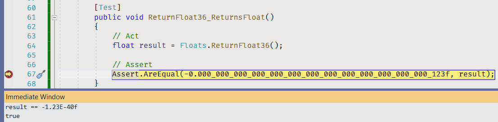

After completing the [ReturnFloat38](RealNumbers/Floats.cs#L49) method navigate to the [ReturnFloat38_ReturnsFloat](RealNumbers.Tests/FloatsTests.cs#L87) unit test and take a look at the float literal that unit tests uses for comparing with the method result.

_1.04829482E+27_ is a scientific notation for the _1,048,294,820,000,000,000,000,000,000_ number. This number does't equal to what you return from your _ReturnLongInteger38_ method. This happens because of the limitations of data format the program uses to store a floating-point number. The value is rounded automatically because the number is too huge.

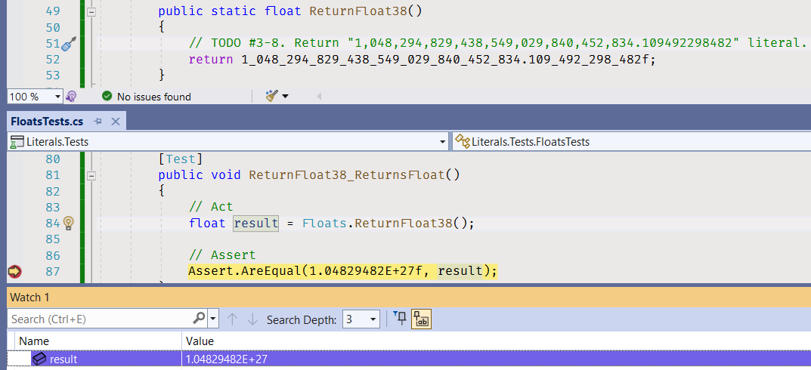

The same is true for the number in the [ReturnFloat39](RealNumbers/Floats.cs#L55) method.

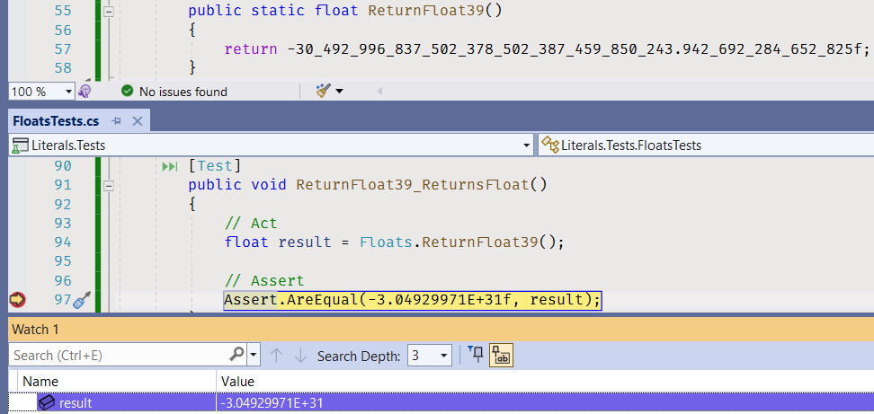

Also, floating-point numbers have accuracy issues (see [Accuracy Problems](https://en.wikipedia.org/wiki/Floating-point_arithmetic#Accuracy_problems)), and floating-point operations cannot precisely represent true arithmetic operations.

```cs
public static float ReturnFloat310()
{
    return 0.6f + 0.1f;
}
```

The result of the expression won't be equal to _0.7_:

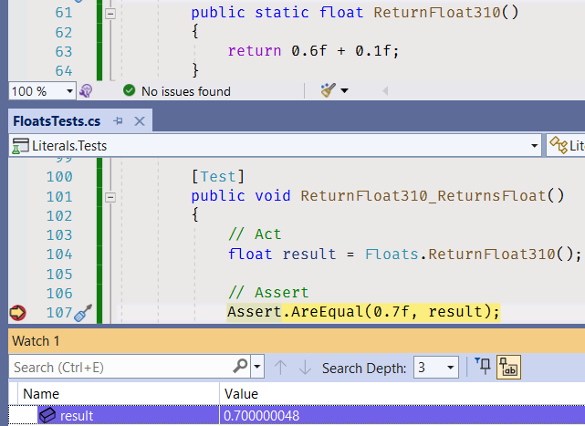

Replace the expression with the expression result to return the correct value from the [ReturnFloat310](RealNumbers/Floats.cs#L61) method.

```cs
public static float ReturnFloat310()
{
    return 0.7f;
}
```


### _double_ data type

Open the [Doubles.cs](RealNumbers/Doubles.cs) file, and implement all methods using the information from the table below.

| Method Name    | Number                                                          |
|----------------|-----------------------------------------------------------------|
| ReturnDouble41 | 0.0                                                             |
| ReturnDouble42 | 0.0001                                                          |
| ReturnDouble43 | -10,000.0000000001                                              |
| ReturnDouble44 | 1,048,294,829,438,549,029,840,452,834.109492298482              |
| ReturnDouble45 | -30,492,996,837,502,378,502,387,459,850,243.942692284652825     |
| ReturnDouble46 | 0.6 + 0.1                                                       |

After completing the [ReturnDouble44](RealNumbers/Doubles.cs#L23) method navigate to the [ReturnDouble44_ReturnsDouble](RealNumbers.Tests/DoublesTests.cs#L45) unit test and take a look at the _double_ literal that unit tests uses for comparing with the method result.  Compare the method result with the result of the _ReturnFloat38_ method.

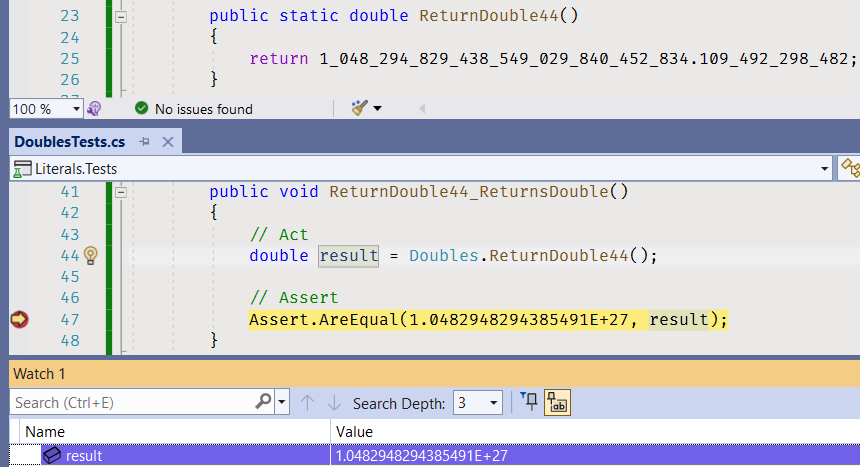

_1.0482948294385491E+27_ is a scientific notation for the _1,048,294,829,438,549,100,000,000,000.0_ number. The _double_ data type has higher precision, but the number is still truncated.

After completing the [ReturnDouble45](RealNumbers/Doubles.cs#L29) method navigate to the [ReturnDouble45_ReturnsDouble](RealNumbers.Tests/DoublesTests.cs#L55) unit test and take a look at the _double_ literal that unit tests uses for comparing with the method result. Compare the method result with the result of the _ReturnFloat39_ method.

Compare the result of the sum expression in the [ReturnDouble46](RealNumbers/Doubles.cs#L23) method with the _double_ literal in the [ReturnDouble46_ReturnsDouble](RealNumbers.Tests/DoublesTests.cs#L65) unit test:

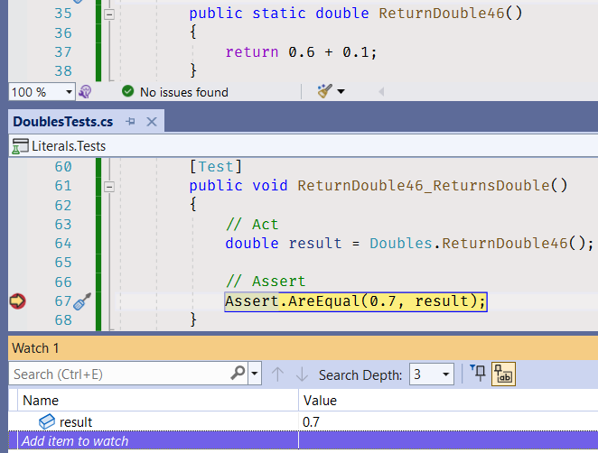

The _double_ data type is much more accurate than _float_, therefore the expression result equals to _0.7_.


### _decimal_ data type

Open the [Decimals.cs](RealNumbers/Decimals.cs) file, and implement all methods using the information from the table below.

| Method Name     | Number                                                  |
|-----------------|---------------------------------------------------------|
| ReturnDecimal51 | 0.0                                                     |
| ReturnDecimal52 | 0.0000001                                               |
| ReturnDecimal53 | -10,000.0000000001                                      |
| ReturnDecimal54 | 1,048,294,829,438,549,029,840,452,834.109492298482      |
| ReturnDecimal55 | -30,492,996,837,502,378,502,387,459,850.942692284652825 |
| ReturnDecimal56 | 0.6 + 0.1                                               |

After completing the [ReturnDecimal54](RealNumbers/Decimals.cs#L23) method navigate to the [ReturnDecimal54_ReturnsDecimal](RealNumbers.Tests/DecimalsTests.cs#L45) unit test and take a look at the _decimal_ literal that unit tests uses for comparing with the method result. Compare the method result with the result of the _ReturnFloat38_ and the _ReturnDouble44_ methods.

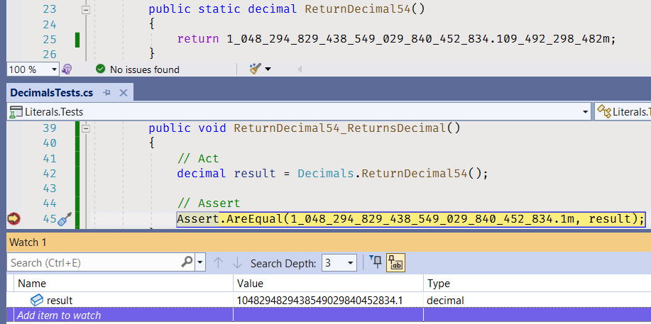

After completing the [ReturnDecimal55](RealNumbers/Decimals.cs#L29) method navigate to the [ReturnDecimal55_ReturnsDecimal](RealNumbers.Tests/DecimalsTests.cs#L55) unit test and take a look at the _decimal_ literal that unit tests uses for comparing with the method result. Compare the method result with the result of the _ReturnFloat39_ and the _ReturnDouble45_ methods.

Compare the result of the sum expression in the [ReturnDecimal56](RealNumbers/Decimals.cs#L35) method with the _double_ literal in the [ReturnDouble46_ReturnsDouble](RealNumbers.Tests/DecimalsTests.cs#L65) unit test.


### Accuracy

Use the [Immediate window](https://docs.microsoft.com/en-us/visualstudio/ide/reference/immediate-window) to calculate expressions for the data types from the table below.

| Expression   | float result | double result      | decimal result |
---------------|--------------|--------------------|----------------|
| 0.6 + 0.1    | 0.700000048  | 0.7                | 0.7            |
| 1.2 + 0.1    |              |                    |                |
| 1.7 + 0.1    |              |                    |                |
| 2.55 * 100.0 |              |                    |                |

(You don't have to put the result table in your repository.)

1. Toggle a breakpoint in a unit test (you can use any unit test from the project).

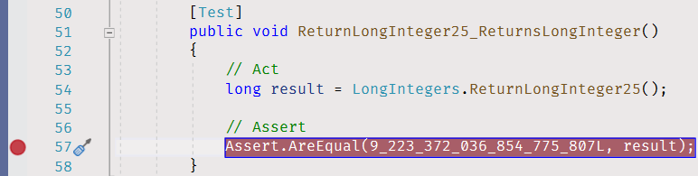

2. Debug the unit test you toggled breakpoint in.

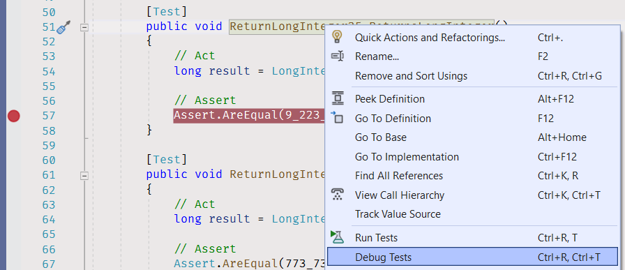

2. Open the Immediate window.

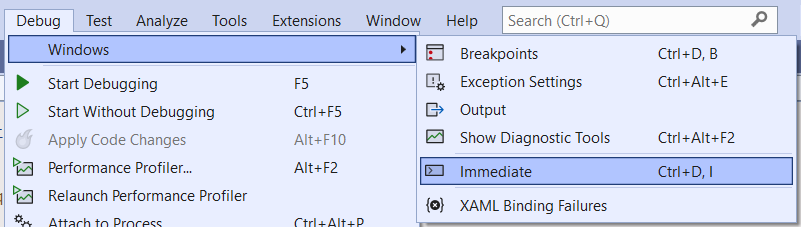

3. Put an expression to the Immediate window, and press Enter key.

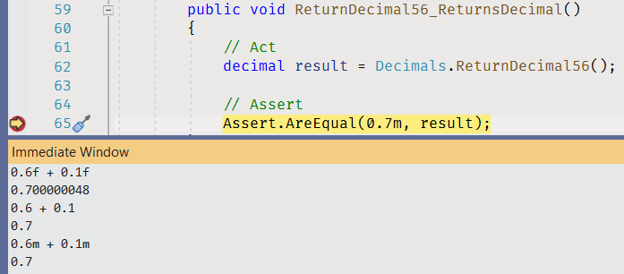


## Fix Compiler Issues

Additional style and code checks are enabled for the projects in this solution to help you maintaining consistency of the project source code and avoiding silly mistakes. [Review the Error List](https://docs.microsoft.com/en-us/visualstudio/ide/find-and-fix-code-errors#review-the-error-list) in Visual Studio to see all compiler warnings and errors.

If a compiler error or warning message is not clear, [review errors details](https://docs.microsoft.com/en-us/visualstudio/ide/find-and-fix-code-errors#review-errors-in-detail) or google the error or warning code to get more information about the issue.


## Task Checklist

1. Rebuild the solution.
1. Fix all compiler warnings and errors.
1. Run all unit tests, make sure all unit tests completed successfully.
1. Review all changes, make sure the only code files (.cs) in RealNumbers project have changes. No changes in project files (.csproj) or in RealNumbers.Tests project.
1. Stage your changes, and create a commit.
1. Push your changes to remote repository.


## See also

* C# Language Reference
  * [Floating-point numeric types](https://docs.microsoft.com/en-us/dotnet/csharp/language-reference/builtin-types/floating-point-numeric-types)
* .NET API
  * [Single Struct](https://docs.microsoft.com/en-us/dotnet/api/system.single)
  * [Double Struct](https://docs.microsoft.com/en-us/dotnet/api/system.double)
  * [Decimal Struct](https://docs.microsoft.com/en-us/dotnet/api/system.decimal)

