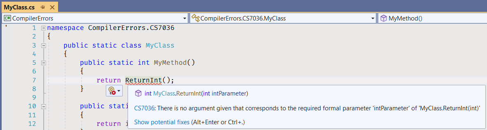

# Static Methods - Compiler Errors

Beginner level task to practice fixing the most common compiler errors.

Estimated time to complete the task - 1h.

The task requires .NET 6 SDK installed.


## Task Description

The task has five sub-tasks. Each sub-task is a small coding exercise.


## CS0103

1. [Build the solution](https://docs.microsoft.com/en-us/visualstudio/ide/building-and-cleaning-projects-and-solutions-in-visual-studio).
    * Click on the menu item - _Build\Build Solution_.
    * Or use the default keyboard shortcut - _Ctrl+Shift+B_ (different versions of Visual Studio may have different keyboard shortcuts. See [Keyboard shortcuts in Visual Studio](https://docs.microsoft.com/en-us/visualstudio/ide/default-keyboard-shortcuts-in-visual-studio) article).


2. Open the [Error List](https://docs.microsoft.com/en-us/visualstudio/ide/find-and-fix-code-errors#review-the-error-list) view.
    * Click on the menu item - _View\Error List_.
    * Or use the default shortcut - _Ctrl+\\, E_.


3. Find an error with CS0103 code and review the error in detail by clicking on the link in the "Code" column.


You will get to the issue documentation page.

4. Double-click on the CS0103 issue in the _Error List_ window. 


You will get to the [CS0103/MyClass.cs](CompilerErrors/CS0103/MyClass.cs) file.


5. Read the documentation page and learn [how to fix the error](https://docs.microsoft.com/en-us/dotnet/csharp/language-reference/compiler-messages/cs0103): "Check the spelling of the name and check your [**using** directives](https://docs.microsoft.com/en-us/dotnet/csharp/language-reference/keywords/using-directive) and assembly references to make sure that the name that you are trying to use is available."

6. Replace the name of the method called in the return statement with correct spelling - _ReturnInt_.

```cs
public static int MyMethod()
{
    return ReturnInt(intParameter: 534_947_886);
}
```

7. Rebuild the solution.


8. Open the _Error List_ window again and make sure there are no CS0103 issues.


## CS0117


1. Open the _Error List_ window, find the CS0117 issue.
2. Open and read the issue documentation page.
3. Navigate to the code by clicking on the issue line in _Error List_ window.
4. Replace the name of the method called in the return statement with correct spelling - _ReturnLong_.

```cs
public static long MyMethod()
{
    return AnotherClass.ReturnLong(longParameter: 49_023_471L);
}
```

5. Rebuild the solution.
6. Open the _Error List_ window again and make sure there are no CS0117 issues anymore.


## CS1501


Fix the issue by removing the method argument from the method call.

```cs
public static int MyMethod()
{
    return ReturnInt();
}
```


## CS1739


Fix the issue by replacing the named parameter with correct argument name.

```cs
public static int MyMethod()
{
    return ReturnInt(intParameter: 9_389_572);
}
```


## CS7036



Fix the issue by adding the parameter to the _ReturnInt_ method call.

```cs
public static int MyMethod()
{
    return ReturnInt(5_689_375);
}
```


## Fix Compiler Issues

Additional style and code checks are enabled for the projects in this solution to help you maintaining consistency of the project source code and avoiding silly mistakes. [Review the Error List](https://docs.microsoft.com/en-us/visualstudio/ide/find-and-fix-code-errors#review-the-error-list) in Visual Studio to see all compiler warnings and errors.

If a compiler error or warning message is not clear, [review errors details](https://docs.microsoft.com/en-us/visualstudio/ide/find-and-fix-code-errors#review-errors-in-detail) or google the error or warning code to get more information about the issue.


## Task Checklist

1. Rebuild the solution.
2. Fix all compiler warnings and errors. Make sure there are no warnings and errors in _Error List_.


3. Run all unit tests, make sure all unit tests completed successfully.


4. Review all changes, make sure that only the code files (.cs) in CompilerErrors project are changed.


Do not make any changes to project files (.csproj) or in code files in CompilerErrors.Tests project.


5. Stage your changes.


All your changes are staged now.


6. Create a commit and push your changes to remote repository.


## See also

* Visual Studio
  * [Getting Started with Visual Studio 2019](https://www.youtube.com/watch?v=1CgsMtUmVgs)
  * [Default keyboard shortcuts in Visual Studio](https://docs.microsoft.com/en-us/visualstudio/ide/default-keyboard-shortcuts-in-visual-studio)

