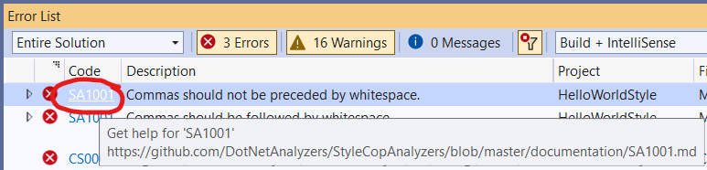
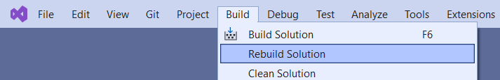
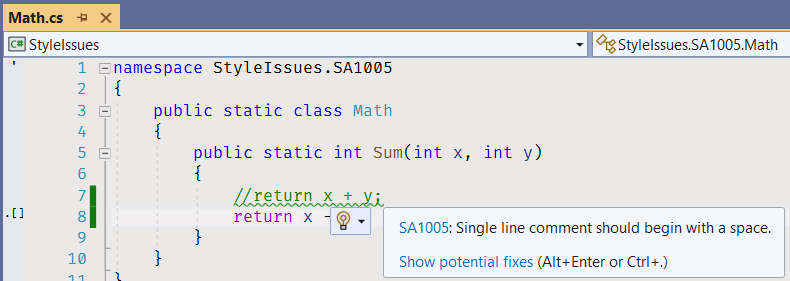
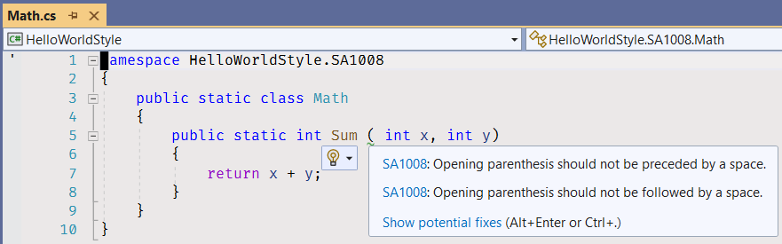
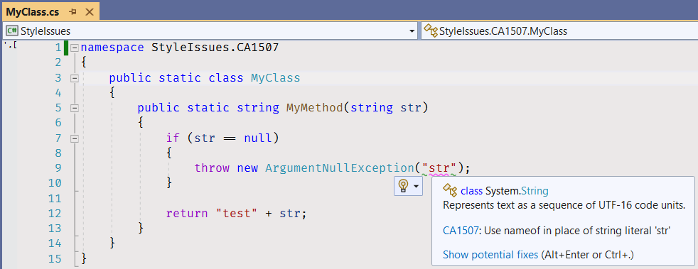
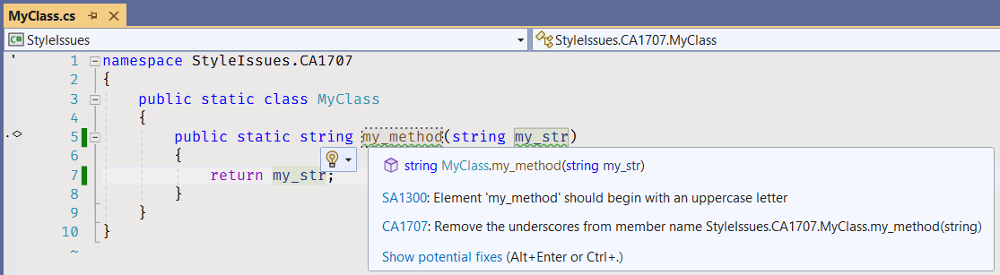
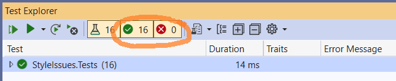
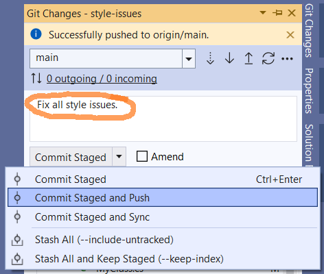

# Исправление стилистических ошибок

Задача начального уровня для практики навыка поиска и исправления стилистических ошибок, обнаруженных инструментами анализа кода.

Переводы: [Английский](README.md).

Время на выполнение задания - 1h.

Для сборки проектов требуется установленный .NET 6 SDK.


## Описание задания

## Замечания StyleCop

[Анализаторы StyleCop](https://github.com/DotNetAnalyzers/StyleCopAnalyzers) это инструмент статического анализа кода, который используется для поиска в коде стилистических ошибок. У StyleCop есть [файл настроек](code-analysis.ruleset), в котором находится список включенных правил, и инструмент генерирует ошибку или предупреждение, если правило нарушается. Документацию правил и разъяснение условий применения правил можно найти в [разделе документации StyleCop](https://github.com/DotNetAnalyzers/StyleCopAnalyzers/blob/master/DOCUMENTATION.md).


### SA1001

1. [Build the solution](https://docs.microsoft.com/en-us/visualstudio/ide/building-and-cleaning-projects-and-solutions-in-visual-studio).
    * Click on the menu item - _Build\Build Solution_.
    * Or use the default keyboard shortcut - _Ctrl+Shift+B_ (various versions of Visual Studio may have different keyboard shortcuts. See [Keyboard shortcuts in Visual Studio](https://docs.microsoft.com/en-us/visualstudio/ide/default-keyboard-shortcuts-in-visual-studio) article).


2. Open the [Error List](https://docs.microsoft.com/en-us/visualstudio/ide/find-and-fix-code-errors#review-the-error-list) view.
    * Click on the menu item - _View\Error List_.
    * Or use default shortcut - _Ctrl+\\, E_.


3. Find an error with SA1001 code and review the error in detail by clicking on the link the "Code" column.



You will get to the issue documentation page.

4. Double-click on the SA1001 issue in the Error List view. 


You will get to [SA1001/Math.cs](StyleIssues/SA1001/Math.cs) file.


5. Read the documentation page and learn [how to fix the error](https://github.com/DotNetAnalyzers/StyleCopAnalyzers/blob/master/documentation/SA1001.md#how-to-fix-violations): "To fix a violation of this rule, ensure that the comma is followed by a single space, and is not preceded by any space."

6. Remove a space before a comma in the method parameter list. 

```cs
public static int Sum(int x,int y)
```

7. Add a space after the comma.

```cs
public static int Sum(int x, int y)
```

8. Rebuild the solution.



9. Open the _Error List_ view again and make sure there are no SA1001 issues.


### SA1002


1. Open _Error List_ view, find SA1002 issue.
1. Open and read the issue documentation page.
1. Navigate to the code by clicking on the issue line in _Error List_ view.
1. Remove a space before a semicolon.
1. Rebuild the solution.
1. Open the _Error List_ view again and make sure there are no SA1002 issues anymore.


### SA1005



Fix the issue by removing the incorrect code line and uncommenting the commented code.


### SA1008



Fix the issue by removing a space before and after opening parenthesis.


### SA1025


Fix the issue by removing redundant space characters.


### SA1028


Fix the issue by removing unnecessary space characters in the end of the lines.


### SA1500


Fix the issue by putting opening and closing curly brackets on new lines.


### SA1505


Fix the issue by removing an empty line after an opening curly bracket.


### SA1507


Fix the issue by removing a redundant empty line.


### SA1508


Fix the issue by removing empty lines before the closing curly brackets.

You can go to AutoCode portal, open the task page, and click on the "Check task" button.


## Roslyn Analyzers

[.NET compiler platform analyzers](https://docs.microsoft.com/en-us/dotnet/fundamentals/code-analysis/overview) inspect your C# code for code quality and style issues. Starting with .NET 5, these analyzers are included with the .NET SDK. If your project targets .NET 5 or later, code analysis is enabled by default.


### CA1304


Fix the issue by adding an _InvariantCulture_ parameter to the _ToUpper_ method call.

```cs
public static string MyMethod(string str)
{
    return "K-" + str.ToUpper(CultureInfo.InvariantCulture);
}
```


### CA1305


Fix the issue by adding an _InvariantCulture_ parameter to the _ToUpper_ method call.

```cs
public static string MyMethod(int i)
{
    return "X" + i.ToString(CultureInfo.InvariantCulture);
}
```


### CA1507



Fix the issue by using a [nameof expression](https://docs.microsoft.com/en-us/dotnet/csharp/language-reference/operators/nameof) as an exception constructor parameter.

```cs
public static string MyMethod(string str)
{
    if (str == null)
    {
        throw new ArgumentNullException(nameof(str));
    }

    return "test" + str;
}
```


### CA1707 & SA1300



Fix the issue by removing an underscore from the method name. Use [standard C# capitalization conventions](https://docs.microsoft.com/en-us/dotnet/standard/design-guidelines/capitalization-conventions): _Pascal Casing_ for method names and _Camel Casing_ for parameter names.

```cs
public static string MyMethod(string myStr)
{
    return myStr;
}
```


## Исправьте ошибки компилятора

Для всех проектов решения включены дополнительные проверки на стилистические ошибки и добавлены анализаторы кода, чтобы помочь Вам поддерживать целостность кодовой базы и избежать наивных ошибок. Все ошибки и предупреждения компилятора C# доступны в окне Visual Studio [Error List](https://docs.microsoft.com/ru-ru/visualstudio/ide/find-and-fix-code-errors#review-the-error-list).

Если сообщение об ошибке или предупреждение компилятора поставило Вас в тупик, [откройте страницу документации ошибки или предупреждения](https://docs.microsoft.com/ru-ru/visualstudio/ide/find-and-fix-code-errors#review-errors-in-detail) или загуглите код ошибки в поисковике.

Также вы можете использовать [базу знаний правил Sonar](https://rules.sonarsource.com/csharp) для поиска дополнительной информации об ошибках, которые возникают на этапе проверки задания анализатором Sonar.


## Исправьте замечания компилятора

Для проектов в этом задании включены дополнительные проверки стиля и качества кода. Эти проверки помогут вам поддерживать целостность исходного кода и избежать тривиальных ошибок. Чтобы увидеть все ошибки и предупреждения компилятора, откройте закладку [Error List](https://docs.microsoft.com/en-us/visualstudio/ide/find-and-fix-code-errors#review-the-error-list).

Если сообщения компилятора недостаточно понятны, то [откройте подробности о сообщении](https://docs.microsoft.com/en-us/visualstudio/ide/find-and-fix-code-errors#review-errors-in-detail) или погуглите код ошибки или предупреждения, чтобы получить больше информации о сообщении.


## Чеклист задания

1. Соберите решение.
2. Исправьте все ошибки и предупреждения компилятора. Убедитесь, что в окне _Error List_ нет ошибко и предупреждений компилятора.


3. Запустите все юнит тесты. Убедитесь, что все юнит тесты пройдены успешно.



4. Просмотрите все изменения. Убедитесь, что изменения сделаны только в файлах с кодом (.cs), которые находятся в проекте StyleIssues.


Изменений в файлах проекта (.csproj) и в файлах с кодов в проекте StyleIssues.Tests быть не должно.


5. Зафиксируйте изменения.


Все ваши изменения зафиксированы.


6. Создайте коммит и поместите ваши изменения в удаленный репозиторий.




## Дополнительная информация

* Visual Studio
  * [Getting Started with Visual Studio 2019](https://www.youtube.com/watch?v=1CgsMtUmVgs)
  * [Default keyboard shortcuts in Visual Studio](https://docs.microsoft.com/en-us/visualstudio/ide/default-keyboard-shortcuts-in-visual-studio)
