# Fixing Style Issues

Beginner level task to practice fixing code style issues detected by code analysis tools.

Translations: [Russian](README-RU.md).

Estimated time to complete the task - 0.5h.

The task requires .NET 6 SDK installed.


## Task Description

### StyleCop Issues

[StyleCop Analyzers](https://github.com/DotNetAnalyzers/StyleCopAnalyzers) is a code analysis tool used to detect code style issues. StyleCop has a [settings file](code-analysis.ruleset) with a list of enabled rules and it raises an error or a warning in case a rule is violated. For rules documentation and reasoning on the rules themselves, see the [Documentation section](https://github.com/DotNetAnalyzers/StyleCopAnalyzers/blob/master/DOCUMENTATION.md).


#### SA1001

1. [Build the solution](https://docs.microsoft.com/en-us/visualstudio/ide/building-and-cleaning-projects-and-solutions-in-visual-studio).
    * Click on the menu item - _Build\Build Solution_.
    * Or use the default keyboard shortcut - _Ctrl+Shift+B_ (various versions of Visual Studio may have different keyboard shortcuts. See [Keyboard shortcuts in Visual Studio](https://docs.microsoft.com/en-us/visualstudio/ide/default-keyboard-shortcuts-in-visual-studio) article).

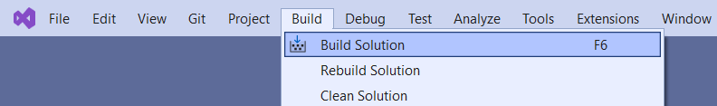

2. Open the [Error List](https://docs.microsoft.com/en-us/visualstudio/ide/find-and-fix-code-errors#review-the-error-list) view.
    * Click on the menu item - _View\Error List_.
    * Or use the default shortcut - _Ctrl+\\, E_.

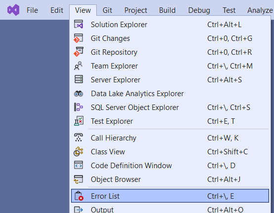

3. Find an error with SA1001 code and review the error in detail by clicking on the link in the "Code" column.

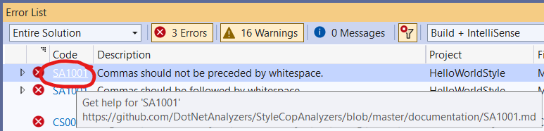

You will get to the issue documentation page.

4. Double-click on the SA1001 issue in the _Error List_ view. 

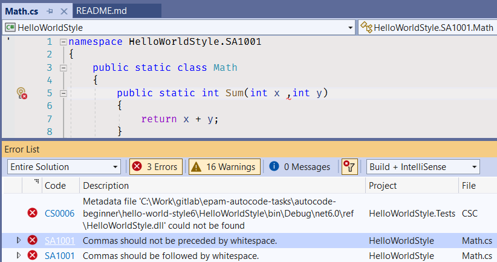

You will get to the [SA1001/Math.cs](StyleIssues/SA1001/Math.cs) file.


5. Read the documentation page and learn [how to fix the error](https://github.com/DotNetAnalyzers/StyleCopAnalyzers/blob/master/documentation/SA1001.md#how-to-fix-violations): "To fix a violation of this rule, ensure that the comma is followed by a single space, and is not preceded by any space."

6. Remove a whitespace before a comma in the method parameter list. 

```cs
public static int Sum(int x,int y)
```

7. Add a whitespace after the comma.

```cs
public static int Sum(int x, int y)
```

8. Rebuild the solution.


9. Open the _Error List_ view again and make sure there are no SA1001 issues.


#### SA1002

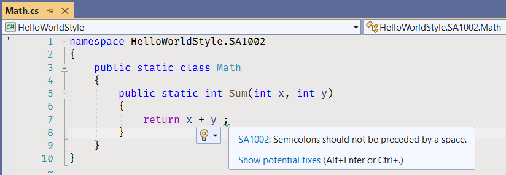

1. Open the _Error List_ view, find the SA1002 issue.
1. Open and read the issue documentation page.
1. Navigate to the code by clicking on the issue line in _Error List_ view.
1. Remove the whitespace before the semicolon.
1. Rebuild the solution.
1. Open the _Error List_ view again and make sure there are no SA1002 issues anymore.


#### SA1005

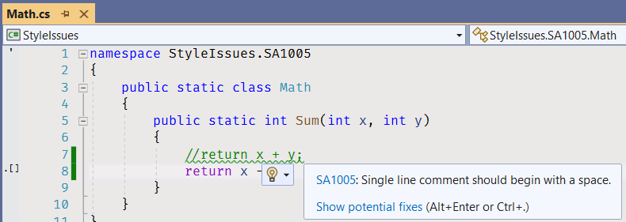

Fix the issue by removing the incorrect code line and uncommenting the commented code.


#### SA1008

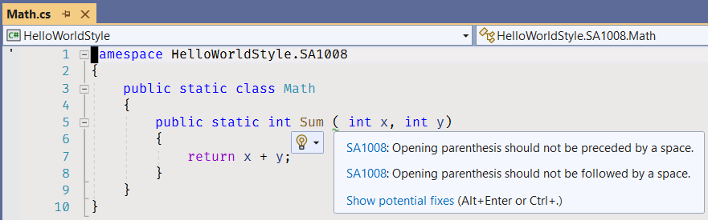

Fix the issue by removing the whitespace before and after opening parenthesis.


#### SA1025

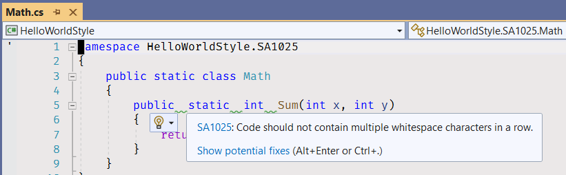

Fix the issue by removing redundant whitespace characters.


#### SA1028

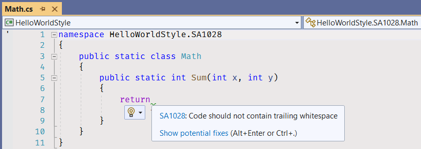

Fix the issue by removing unnecessary whitespace characters at the end of the lines.


#### SA1500

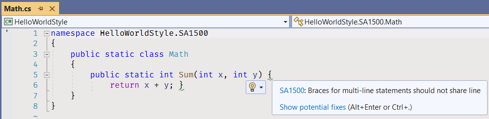

Fix the issue by putting opening and closing curly brackets on new lines.


#### SA1505

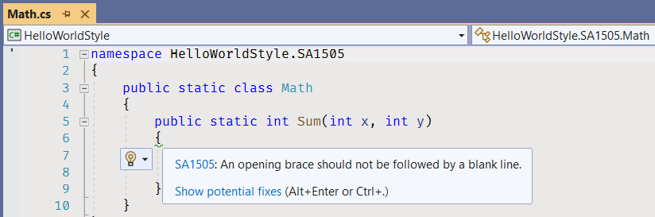

Fix the issue by removing the empty line after the opening curly bracket.


#### SA1507

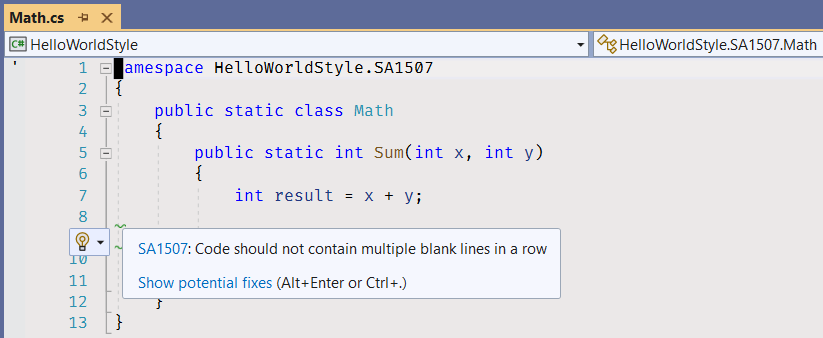

Fix the issue by removing the redundant empty line.


#### SA1508

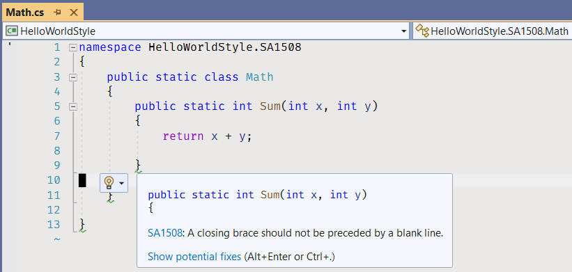

Fix the issue by removing the empty lines before the closing curly brackets.

You can go to the AutoCode portal, open the task page, and click on the "Check task" button.


### Roslyn Analyzers

[.NET compiler platform analyzers](https://docs.microsoft.com/en-us/dotnet/fundamentals/code-analysis/overview) inspect your C# code for code quality and style issues. Starting with .NET 5, these analyzers are included with the .NET SDK. If your project targets .NET 5 or later, code analysis is enabled by default.


#### CA1304

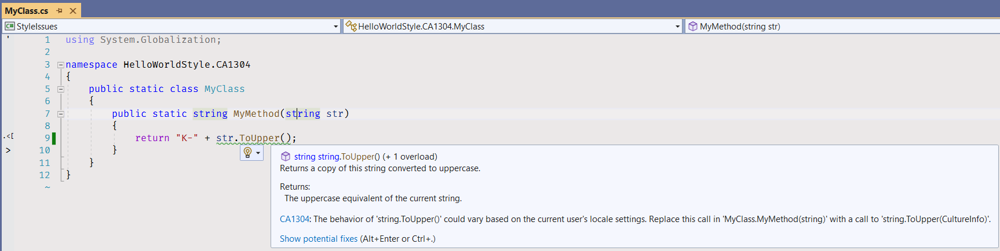

Fix the issue by adding an _InvariantCulture_ parameter to the _ToUpper_ method call.

```cs
public static string MyMethod(string str)
{
    return "K-" + str.ToUpper(CultureInfo.InvariantCulture);
}
```


#### CA1305

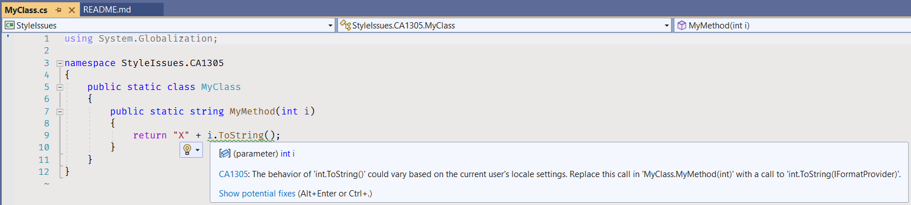

Fix the issue by adding an _InvariantCulture_ parameter to the _ToUpper_ method call.

```cs
public static string MyMethod(int i)
{
    return "X" + i.ToString(CultureInfo.InvariantCulture);
}
```


#### CA1507

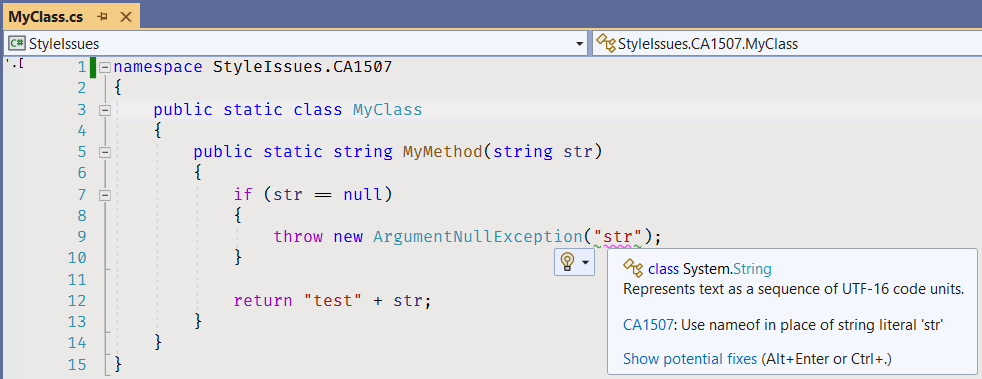

Fix the issue by using the [nameof expression](https://docs.microsoft.com/en-us/dotnet/csharp/language-reference/operators/nameof) as an exception constructor parameter.

```cs
public static string MyMethod(string str)
{
    if (str == null)
    {
        throw new ArgumentNullException(nameof(str));
    }

    return "test" + str;
}
```


#### CA1707 & SA1300

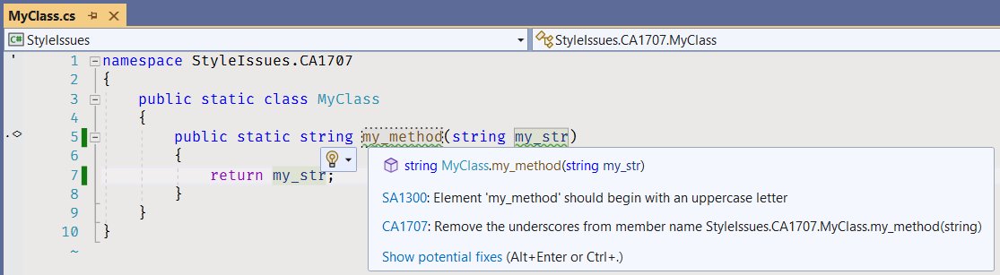

Fix the issue by removing the underscore from the method name. Use the [standard C# capitalization conventions](https://docs.microsoft.com/en-us/dotnet/standard/design-guidelines/capitalization-conventions): _Pascal Casing_ for method names and _Camel Casing_ for parameter names.

```cs
public static string MyMethod(string myStr)
{
    return myStr;
}
```


## Fix Compiler Issues

Additional style and code checks are enabled for the projects in this solution to help you maintaining consistency of the project source code and avoiding silly mistakes. [Review the Error List](https://docs.microsoft.com/en-us/visualstudio/ide/find-and-fix-code-errors#review-the-error-list) in Visual Studio to see all compiler warnings and errors.

If a compiler error or warning message is not clear, [review errors details](https://docs.microsoft.com/en-us/visualstudio/ide/find-and-fix-code-errors#review-errors-in-detail) or google the error or warning code to get more information about the issue.

Also, you can use [Sonar rule knowledge database](https://rules.sonarsource.com/csharp) for searching more detailed information regarding detected Sonars' issues.


## Task Checklist

1. Rebuild the solution.
2. Fix all compiler warnings and errors. Make sure there are no warnings and errors in _Error List_.

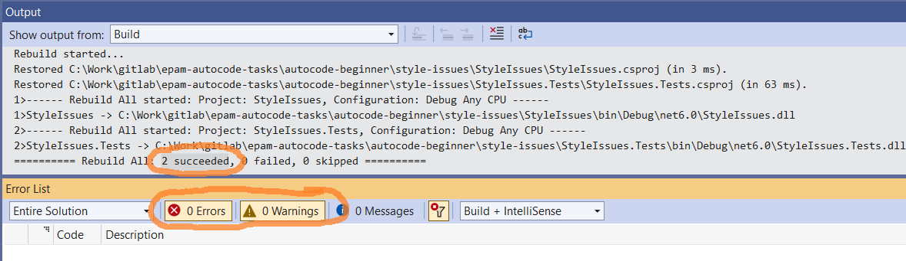

3. Run all unit tests, make sure all unit tests completed successfully.

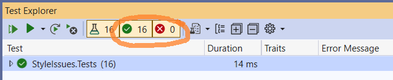

4. Review all changes, make sure that only the code files (.cs) in StyleIssues project are changed.

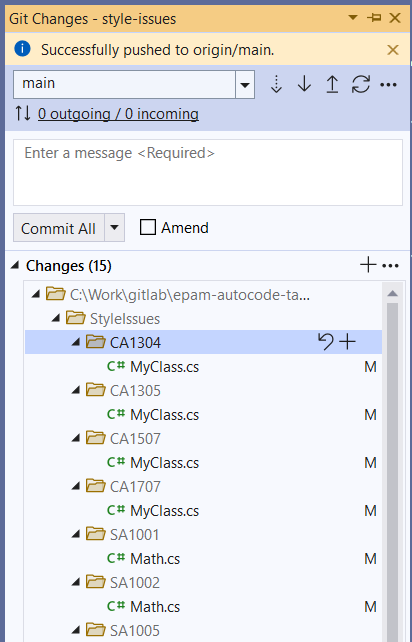

Do not make any changes to project files (.csproj) or in code files in StyleIssues.Tests project.

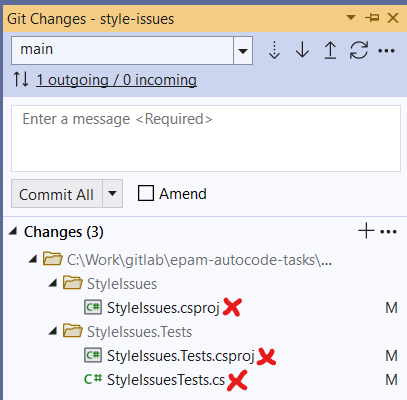

5. Stage your changes.

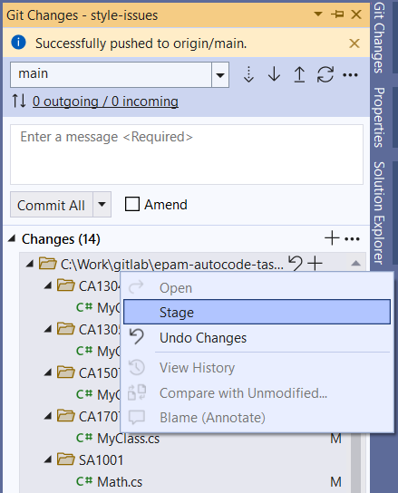

All your changes are staged now.

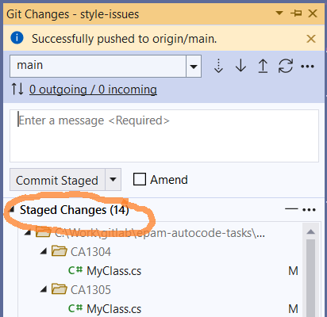

6. Create a commit and push your changes to remote repository.

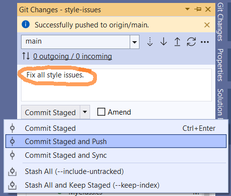


## See also

* Visual Studio
  * [Getting Started with Visual Studio 2019](https://www.youtube.com/watch?v=1CgsMtUmVgs)
  * [Default keyboard shortcuts in Visual Studio](https://docs.microsoft.com/en-us/visualstudio/ide/default-keyboard-shortcuts-in-visual-studio)
