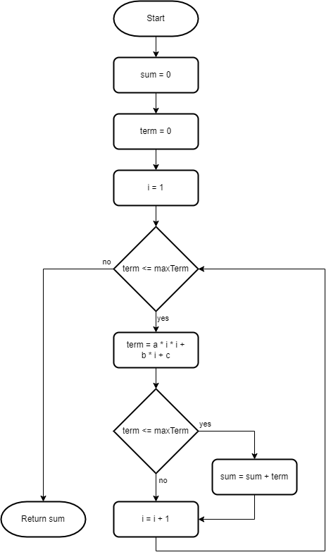

# While Statements

Beginner level task for practicing while statements.

Estimated time to complete the task - 3h.

The task requires .NET 6 SDK installed.


## Task Description

The task has fifteen sub-tasks in five sections. Each sub-task is a small coding exercise.

Basic understanding of [flowchart diagrams](https://en.wikipedia.org/wiki/Flowchart) (или см. русскоязычную [статью Блок-схема](https://ru.wikipedia.org/wiki/%D0%91%D0%BB%D0%BE%D0%BA-%D1%81%D1%85%D0%B5%D0%BC%D0%B0)) is required to successfully complete the task. If you are not familiar with flowchart diagrams, read the Wikipedia article first.

Use the only *while* and *if-else* statements in this task. Using *for* or *do-while* iteration statements is not required.


### Arithmetic Sequences

An [arithmetic sequence](https://www.google.com/search?q=arithmetic+sequence) is an ordered set of terms (numbers) that have a common difference between each consecutive term.

The arithmetic sequence formula is given as,

$`a_{n} = a+(n-1)*d`$

where,
* $`a_{n}`$ is the nth term,
* $`a`$ is the first term, and
* d is the [common difference](https://www.google.com/search?q=arithmetic+sequence+common+difference).


#### Sub-task 1

Open the [ArithmeticSequences.cs](WhileStatements/ArithmeticSequences.cs) file, and navigate to the [SumArithmeticSequenceTerms1](WhileStatements/ArithmeticSequences.cs#L5) method.

Implement the method that returns sum of an arithmetic sequence terms if the common difference is 1.

$`\sum_{i=1}^{n} a+(i-1)*1=\sum_{i=0}^{n-1} a+i`$

For the arithmetic sequence $`{5, 6, 7, 8, 9, ...}`$ the sum of the first five elements is 35 (5 + 6 + 7 + 8 + 9).

The algorithm you have to implement is shown on the flowchart diagram below. The flowchart notation has no special symbol for a _while_ statement, therefore a decision block is used it.


Read and analyze the diagram, add the code to the _SumArithmeticSequenceTerms1_ method. 

1. Declare and initialize the _sum_ and the _i_ variables. Add the [return statement](https://docs.microsoft.com/en-us/dotnet/csharp/language-reference/statements/jump-statements#the-return-statement) to return the _sum_ value.

```cs
public static int SumArithmeticSequenceTerms1(int a, int n)
{
    int sum = 0, i = 0;

    return sum;
}
```

2. Add the [while statement](https://docs.microsoft.com/en-us/dotnet/csharp/language-reference/statements/iteration-statements#the-while-statement) that iterates until _i_ is less than _n_.

```cs
public static int SumArithmeticSequenceTerms1(int a, int n)
{
    int sum = 0, i = 0;

    while (i < n)
    {
        i = i + 1;
    }

    return sum;
}
```

3. Add the sum calculation.

```cs
public static int SumArithmeticSequenceTerms1(int a, int n)
{
    int sum = 0, i = 0;

    while (i < n)
    {
        sum = sum + a + i
        i = i + 1;
    }

    return sum;
}
```

4. Replace the assignment with [addition assignment operator +=](https://docs.microsoft.com/en-us/dotnet/csharp/language-reference/operators/addition-operator).

```cs
public static int SumArithmeticSequenceTerms1(int a, int n)
{
    int sum = 0, i = 0;

    while (i < n)
    {
        sum += a + i;
        i = i + 1;
    }

    return sum;
}
```

5. Replace the assignment with [increment operator++](https://docs.microsoft.com/en-us/dotnet/csharp/language-reference/operators/arithmetic-operators#increment-operator-).

```cs
public static int SumArithmeticSequenceTerms1(int a1, int n)
{
    int sum = 0, i = 0;

    while (i < n)
    {
        sum += a + i;
        i++;
    }

    return sum;
}
```


#### Sub-task 2

Open the [ArithmeticSequences.cs](WhileStatements/ArithmeticSequences.cs) file, and navigate to the [SumArithmeticSequenceTerms2](WhileStatements/ArithmeticSequences.cs#L5) method.

Implement the method that returns the sum of an arithmetic sequence elements when the first term is 17 and the common difference is 33.

$`\sum_{i=1}^{n} 17+(i-1)*33=\sum_{i=0}^{n-1} 17+i*33`$

Beginner programmers often put number literals in their code like this:

```cs
public static int SumArithmeticSequenceTerms2(int n)
{
    int sum = 0, i = 0;

    while (i < n)
    {
        sum += 17 + (i * 33);
        i++;
    }

    return sum;
}
```

Experienced programmers consider using number literals with unexplained meaning as a *bad practice*. They call such literals [magic numbers](https://en.wikipedia.org/wiki/Magic_number_(programming)).

If you have a magic number in your code, [replace it with a symbolic constant](https://refactoring.guru/replace-magic-number-with-symbolic-constant):

```cs
public static int SumArithmeticSequenceTerms2(int n)
{
    const int firstTerm = 17;
    const int commonDifference = 33;

    int sum = 0, i = 0;

    while (i < n)
    {
        sum += firstTerm + (i * commonDifference);
        i++;
    }

    return sum;
}
```


#### Sub-task 3

Open the [ArithmeticSequences.cs](WhileStatements/ArithmeticSequences.cs) file, and navigate to the [SumArithmeticSequenceTerms3](WhileStatements/ArithmeticSequences.cs#L5) method.

Implement the method that returns the sum of an arithmetic sequence elements when the common difference is 3.

$`\sum_{i=1}^{n} a+(i-1)*3=\sum_{i=0}^{n-1} a+i*3`$

Introduce a constant to avoid magic numbers in your code.


#### Sub-task 4

Open the [ArithmeticSequences.cs](WhileStatements/ArithmeticSequences.cs) file, and navigate to the [SumArithmeticSequenceTerms4](WhileStatements/ArithmeticSequences.cs#L5) method.

Implement the method that returns the sum of an arithmetic sequence elements.


### Quadratic Sequences

A [quadratic sequence](https://www.google.com/search?q=quadratic+sequence) is an ordered set of terms that follows a rule based on the sequence $`n^2=1, 4, 9, 16, 25, ...`$.

The quadratic sequence formula is:

$`a_{n} = a*n^2+b*n+c`$

where,
* $`a_{n}`$ is the nth term, and
* $`a`$, $`b`$ and $`c`$ are constants.


#### Sub-task 5

Open the [QuadraticSequences.cs](WhileStatements/QuadraticSequences.cs) file, and navigate to the [SumQuadraticSequenceTerms1](WhileStatements/QuadraticSequences.cs#L5) method.

Implement the method that returns sum of a quadratic sequence terms that are less than _maxTerm_.

The quadratic sequence with nth term $`a_{n}=3*n^2+5*n+7`$ is $`\{ 15, 29, 49, 75, 107, 145, ...\}`$.

If _maxTerm_ is 29, the sum is 44 (15 + 29 = 44). If _maxTerm_ is 107, the sum is 275 (15 + 29 + 49 + 75 + 107 = 275).

The algorithm you have to implement is shown on the flowchart diagram below.




#### Sub-task 6

Open the [QuadraticSequences.cs](WhileStatements/QuadraticSequences.cs) file, and navigate to the [SumQuadraticSequenceTerms2](WhileStatements/QuadraticSequences.cs#L5) method.

Implement the method that returns the sum of _count_ quadratic sequence terms starting with the _startN_ term.

For the quadratic sequence $`\{ 15, 29, 49, 75, ...\}`$ the sum is 44 (15 + 29 = 44), if the _startN_ is 1 and _count_ is 2. If _startN_ is 2 and _count_ is 3, the sum is 153 (29 + 49 + 75 = 153).


### Geometric Sequences

A [geometric sequence](https://www.google.com/search?q=geometric+sequence) is a sequence of terms in which the ratio between consecutive terms is constant.

The geometric sequence formula is given as,

$`a_{n} = a*r^n`$

where,
* $`a_{n}`$ is the nth term,
* $`a`$ is the first term, and
* r is the [common ratio](https://www.google.com/search?q=geometric+sequence+common+ratio).


#### Sub-task 7

Open the [GeometricSequences.cs](WhileStatements/GeometricSequences.cs) file, and navigate to the [SumGeometricSequenceTerms1](WhileStatements/GeometricSequences.cs#L5) method.

Implement the method that returns the sum of a geometric sequence terms.

$`\sum_{i=1}^{n}a*r^{i-1}=\sum_{i=0}^{n-1}a*r^{i}=a+a*r^1+a*r^2+a*r^3+...+a*r^{n-1}`$

Use an additional _while_ statement to raise an _r_ number to the power of _n_.

The algorithm you have to implement is shown on the flowchart diagram below.


#### Sub-task 8

Open the [GeometricSequences.cs](WhileStatements/GeometricSequences.cs) file, and navigate to the [SumGeometricSequenceTerms2](WhileStatements/GeometricSequences.cs#L5) method.

Implement the method that returns the sum of a geometric sequence terms when the first term is 13 and the common ratio is 3.

$`\sum_{i=1}^{n}a*r^{i-1}=\sum_{i=0}^{n-1} 13*3^{i}=13+13*3^1+13*3^2+13*3^3+...+13*3^{n-1}`$

Introduce a constant to avoid magic numbers in your code.


#### Sub-task 9

Open the [GeometricSequences.cs](WhileStatements/GeometricSequences.cs) file, and navigate to the [CountGeometricSequenceTerms3](WhileStatements/GeometricSequences.cs#L5) method.

Implement the method that counts terms in a geometric sequence that are less than or equal to _maxTerm_.

If _a_ is 3 and _r_ is 2 the geometric sequence is $`\{3, 6, 12, 24, 48, ...\}`$. If _maxTerm_ is 3 the count equals to 1 ($`\{3\}`$). If  _maxTerm_ is 24 the count equals to 4 ($`\{3, 6, 12, 24\}`$).


#### Sub-task 10

Open the [GeometricSequences.cs](WhileStatements/GeometricSequences.cs) file, and navigate to the [CountGeometricSequenceTerms4](WhileStatements/GeometricSequences.cs#L5) method.

Implement the method that counts terms in a geometric sequence that are greater than or equal to a _minTerm_.

For the geometric sequence $`\{3, 6, 12, 24, 48, 96, 192, 384, 768, 1536, ...\}`$ the count equals to 4 ($`\{192, 384, 768, 1536\}`$) when _n_ is 10 and the _minTerm_ is 192 . If _minTerm_ is 768 the count equals to 2 ($`\{768, 1536\}`$).


### Digits Of a Number

#### Sub-task 11

Open the [Digits.cs](WhileStatements/Digits.cs) file, and navigate to the [GetDigitsSum](WhileStatements/Products.cs#L5) method.

Implement the method that finds the sum of the digits of an _n_ number. For the number 123 the sum of the digits is 6 (1 + 2 + 3).


#### Sub-task 12

Open the [Digits.cs](WhileStatements/Digits.cs) file, and navigate to the [GetDigitsProduct](WhileStatements/Products.cs#L5) method.

Implement the method that finds product of the digits of an _n_ number. For the number 123 the product of the digits is 6 (1 * 2 * 3).


### Prime Numbers

#### Sub-task 13

Open the [PrimeNumbers.cs](WhileStatements/PrimeNumbers.cs) file, and navigate to the [IsPrimeNumber](WhileStatements/PrimeNumbers.cs#L5) method.

Implement the method that returns true when _n_ is a prime number; otherwise the method returns false.


#### Sub-task 14

Open the [PrimeNumbers.cs](WhileStatements/PrimeNumbers.cs) file, and navigate to the [GetLastPrimeNumber](WhileStatements/PrimeNumbers.cs#L5) method.

Implement the method that returns the latest prime number in the (0, n] interval.


#### Sub-task 15

Open the [PrimeNumbers.cs](WhileStatements/PrimeNumbers.cs) file, and navigate to the [SumPrimeNumbers](WhileStatements/PrimeNumbers.cs#L5) method.

Implement the method that returns the sum of the latest _count_ prime numbers in the (0, n] interval.


## Fix Compiler Issues

Additional style and code checks are enabled for the projects in this solution to help you maintaining consistency of the project source code and avoiding silly mistakes. [Review the Error List](https://docs.microsoft.com/en-us/visualstudio/ide/find-and-fix-code-errors#review-the-error-list) in Visual Studio to see all compiler warnings and errors.

If a compiler error or warning message is not clear, [review errors details](https://docs.microsoft.com/en-us/visualstudio/ide/find-and-fix-code-errors#review-errors-in-detail) or google the error or warning code to get more information about the issue.


## Task Checklist

1. Rebuild the solution.
1. Fix all compiler warnings and errors.
1. Run all unit tests, make sure all unit tests completed successfully.
1. Review all changes, make sure the only code files (.cs) in WhileStatements project have changes. No changes in project files (.csproj) or in WhileStatements.Tests project.
1. Stage your changes, and create a commit.
1. Push your changes to remote repository.


## See also

* C# Language Reference
  * [The while statement](https://docs.microsoft.com/en-us/dotnet/csharp/language-reference/statements/iteration-statements#the-while-statement)
  * [The return statement](https://docs.microsoft.com/en-us/dotnet/csharp/language-reference/statements/jump-statements#the-return-statement)
  * [Increment operator](https://docs.microsoft.com/en-us/dotnet/csharp/language-reference/operators/arithmetic-operators#increment-operator-)
  * [Decrement operator](https://docs.microsoft.com/en-us/dotnet/csharp/language-reference/operators/arithmetic-operators#decrement-operator---)
  * [Compound assignment](https://docs.microsoft.com/en-us/dotnet/csharp/language-reference/operators/arithmetic-operators#compound-assignment)
